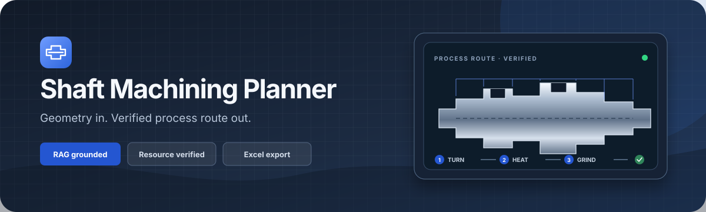
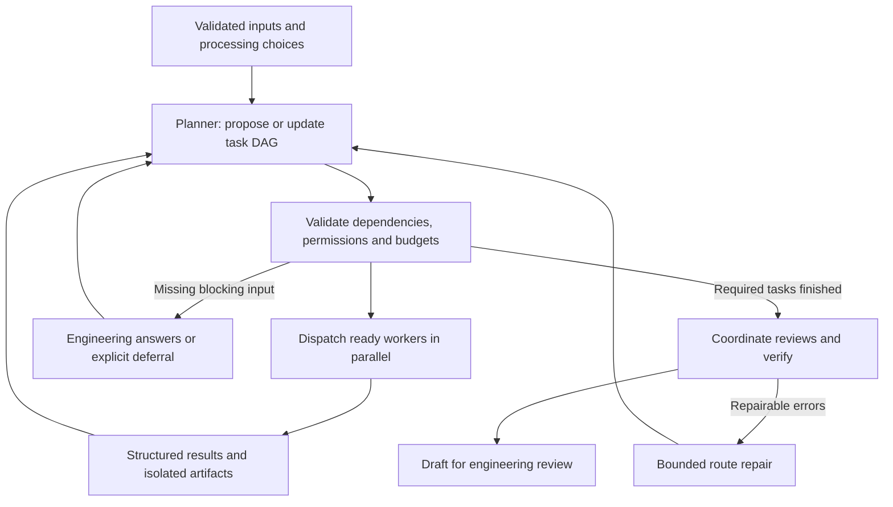

<p align="center">
  
</p>

<h1 align="center">Shaft Machining Planner</h1>

<p align="center">
  <strong>Turn motor-shaft geometry into a resource-checked machining route and an exportable process card.</strong>
</p>

<p align="center">
  <a href="https://github.com/Taxueovo/Shaft-Machining-Planner/actions/workflows/ci.yml"></a>
  <a href="https://www.python.org/"></a>
  <a href="https://fastapi.tiangolo.com/"></a>
  
  <a href="LICENSE"></a>
</p>

<p align="center">
  <a href="#3-installation">Install</a>
  · <a href="#4-running">Run</a>
  · <a href="#1-architecture">Architecture</a>
  · <a href="#7-data-interpretation">Public data</a>
  · <a href=".github/SECURITY.md">Security</a>
  · <a href="CONTRIBUTING.md">Contributing</a>
</p>

---

Describe the shaft — stepped segments, keyways, splines, gears, bores, tapers and
more — and generate a complete process route covering operations, machine tools,
cutting tools, heat treatment and finishing. Planning is grounded in RAG handbooks
and a case base, then checked against local capability libraries before Excel export.

| Model the part | Plan the route | Verify the resources | Export the result |
| :--- | :--- | :--- | :--- |
| Structured geometry with an interactive 3D preview. | Rules + LangGraph with optional human-in-the-loop decisions. | Machine and cutting-tool coverage stays explicit instead of being guessed. | Produce a practical process-card workbook for engineering review. |

> **Engineering boundary:** this is a planning and screening tool. Final cutting
> parameters, fixtures, tolerances, stock and shop availability still require a
> qualified manufacturing engineer.

The project has two deliberately separated services:

- **Backend** (`backend/`) — validation, LangGraph workflow, capability libraries,
  process rules, verification and RAG.
- **Frontend** (`frontend/`) — Jinja2 web UI, dynamic form, status polling and RAG
  management pages. It communicates with the backend only over HTTP/JSON.

## Table of Contents

- [Authors & Maintainers](#authors--maintainers)
- [1. Architecture](#1-architecture)
- [2. Features](#2-features)
- [3. Installation](#3-installation)
- [4. Running](#4-running)
- [5. Environment variables](#5-environment-variables)
- [6. Directory structure](#6-directory-structure)
- [7. Data interpretation](#7-data-interpretation)
- [8. Tests](#8-tests)

## Authors & Maintainers

- **Taxueovo** — core maintainer and primary developer.

## 1. Architecture

```
User
 └─[manual form]──▶ frontend(8000) ──▶ backend(8001) ──▶ process route + resource verification
```

- `backend/`: input validation, LangGraph workflow, machine tool / cutting tool
  Excel libraries, process rules, verification, RAG.
- `frontend/`: Jinja2 pages, dynamic form, status polling, HTTP proxy.
- The frontend never imports backend business functions; the two processes
  communicate only over HTTP/JSON.

## 2. Features

Implemented:

- Structured entry of material, bar stock and stepped segments; segment-relative
  or global-absolute positioning
- Dynamic feature input: keyway, hole, flat, thread, knurl, bearing seat, spline,
  taper, recess (relief groove), seal area, gear, flange, **bore** (stepped inner bore)
- High-precision feature detection, LangGraph `interrupt` / `Command(resume=...)`
  for human-in-the-loop timing decisions
- Machine tool / cutting tool filtering, base process route generation,
  conditional operation insertion, per-operation resource display,
  rule-based Verification
- RAG (process handbook + case base) injected into the planning workflow

Not implemented: full manufacturing cost calculation, Word/PDF export, ERP/MES integration and
multi-user support. Local job state is restart-safe in SQLite.

## 3. Installation

Create the Conda environment and install the Python dependencies:

```bash
conda env create -f environment.yml
conda activate shaftplanner
```

or manually:

```bash
conda create -n shaftplanner python=3.10
conda activate shaftplanner
pip install --require-hashes -r requirements.lock.txt
```

The core install excludes Chroma, Torch and sentence-transformers. Install RAG
only when needed with `pip install --require-hashes -r requirements-rag.lock.txt`.

## 4. Running

### One-click start (recommended)

```bash
python start_shaftplanner.py              # starts the backend + frontend, opens the browser
python start_shaftplanner.py --no-browser # do not open the browser
```

The launcher handles: `NO_PROXY` setup (so local requests are not blocked by a
corporate proxy), readiness waiting, unified shutdown on Ctrl+C / process exit,
and idempotent skipping of ports already running.

### Running subsystems individually (debugging)

- `python frontend/run_frontend.py` — frontend only (auto-starts the backend)
- `cd backend && python run_backend.py` — backend only

### Default addresses

| Service          | URL                   |
|------------------|-----------------------|
| peagent frontend | http://127.0.0.1:8000 |
| peagent backend  | http://127.0.0.1:8001 |

## 5. Environment variables

Configuration is read from the project-root `.env` file (see `frontend/main.py`,
`frontend/run_frontend.py` and `backend/run_backend.py`):

| Variable              | Default                   | Description                                        |
|-----------------------|---------------------------|----------------------------------------------------|
| `BACKEND_URL`         | `http://127.0.0.1:8001`   | peagent backend base URL (frontend proxy target)   |
| `FRONTEND_URL`        | `http://127.0.0.1:8000`   | peagent frontend URL (launcher / health checks)    |
| `FRONTEND_HOST`       | `127.0.0.1`               | Frontend listen host                               |
| `BACKEND_HOST`        | `127.0.0.1`               | Backend listen host                                |
| `FRONTEND_PORT`       | `8000`                    | Frontend listen port                               |
| `LOG_LEVEL`           | `info`                    | Uvicorn log level                                  |
| `LOCAL_API_TOKEN`     | generated by launcher     | Private token between the local frontend and backend |
| `LLM_PROVIDER`        | `remote`                  | `rules`, `remote`, or loopback-only `local`           |
| `OPENAI_API_KEY`      | —                         | Main model-provider credential (optional; rule mode works without it) |
| `OPENAI_BASE_URL`     | `https://api.openai.com/v1` | Approved OpenAI-compatible model endpoint          |
| `OPENAI_MODEL`        | `gpt-5-nano`              | Main planning model                                 |
| `LOCAL_MODEL_BASE_URL` | `http://127.0.0.1:11434/v1` | Loopback OpenAI-compatible local model endpoint  |
| `LOCAL_MODEL_NAME`    | `qwen3:8b`                | Local model name                                     |
| `JOB_DB_FILE`         | `data/jobs.sqlite3`       | Local SQLite job-state file (created with mode 0600) |
| `EMBEDDING_API_KEY`   | —                         | Embedding provider API key (required for RAG)      |
| `EMBEDDING_BASE_URL`  | falls back to main endpoint | Approved OpenAI-compatible embedding endpoint      |
| `EMBEDDING_MODEL`     | —                         | Embedding model name (required for RAG)            |
| `RAG_STORE_EXPORTS`   | `false`                   | Opt in to persisting exported process cards in RAG |
| `NO_PROXY`            | set by the launcher       | Localhost proxy bypass (127.0.0.1, localhost)      |

For fully offline planning, set `LLM_PROVIDER=rules`. For Ollama, expose its
OpenAI-compatible endpoint on loopback, set `LLM_PROVIDER=local`, and choose
`LOCAL_MODEL_NAME`; non-loopback local endpoints are rejected.

RAG additionally requires the optional RAG lock file and embedding configuration above;
the RAG management page (`/rag`) shows a notice when it is unavailable.
Both launchers reject non-loopback listen addresses. The application is not a
multi-user web service and must not be exposed through a public proxy.

## 6. Directory structure

```
Shaft Machining Planner/
├── backend/          # peagent backend (process planning workflow)
│   ├── app.py / run_backend.py / service.py / repositories.py
│   ├── models/ rules/ agents/ workflow/ providers/ workers/ planners/
│   ├── database/ rag/ tests/
├── frontend/         # peagent frontend (Web UI)
│   ├── main.py / run_frontend.py
│   ├── templates/ static/
├── data/             # capability libraries (machines.xlsx / tools.xlsx) + case base
├── output/           # process card Excel exports
├── scripts/          # tooling scripts (e.g. documentation generation)
├── docs/             # design documents
├── .env              # unified environment configuration
├── start_shaftplanner.py
└── requirements.txt / requirements.lock.txt / environment.yml
```

## 7. Data interpretation

### Machine tool Excel (`data/machines.xlsx`)

Verifies length, diameter, production status and, where the official source
publishes them, workpiece weight and gear module. Missing precision/type/options
remain clearly labeled as screening-only instead of being silently assumed.

The committed workbook is a small public sample sourced from official DMG MORI,
KAPP NILES and Gleason product pages, including
[NLX 2500 turning](https://us.dmgmori.com/products/machines/turning/universal-turning/nlx/nlx-2500),
[cylindrical grinding](https://en.dmgmori.com/products/machines/grinding/vertical-grinding/nvg/nvg-7lh),
[gear grinding](https://www.kapp-niles.com/en/machines/profile-grinding-machines/kng-ready)
and [gear hobbing](https://www.gleason.com/en/products/machines/cylindrical/hobbing-up-to-300-mm/100h-series-high-speed-hobbing-with-integrated-chamfering-deburring)
capabilities. Each row retains its source URL and verification date. It contains
no customer machines, serial numbers, pricing, contact details, availability or
private configuration data.

### Cutting tool Excel (`data/tools.xlsx`)

Verifies material → ISO category, process step, cutting tool grade, First Choice,
coating and applicable materials; it does not cover specific sizes / stock /
tolerance capability, so some operations end up `not_covered` and the overall
result is usually `conditional_pass`, requiring engineer confirmation.

The sample grade mappings come from ISCAR's public
[grade/application table](https://www.iscar.com/eCatalog/gradesTable/gradesTable.html)
and [technical FAQ](https://www.iscar.com/faq.aspx/countryid/49). They support
coarse grade screening only; insert geometry, size, cutting parameters, stock,
holder, coolant and workholding must be confirmed by an engineer.

### Private-data boundary

- `data/cases.json`, process-card `output/`, RAG source cases/specifications,
  Chroma indexes and exported-card RAG records are ignored by Git.
- Exported cards are not added to RAG unless `RAG_STORE_EXPORTS=true` is set.
- Excel text is escaped before writing so user/model content cannot become a formula.
- Capability workbooks contain only manufacturer-published product facts and
  explicit source attribution. Do not replace them with internal asset lists in a
  public fork.
- `python scripts/verify_public_sources.py` checks approved official hosts and
  review freshness without scraping or changing engineering values. The scheduled
  audit checks reachability; a human must compare source pages before any workbook edit.
- When model or embedding credentials are configured, part geometry, requirements
  and selected RAG text are transmitted to those configured providers. Use only an
  endpoint and retention policy approved for the data classification involved; leave
  the keys unset for rule-only/offline operation.

## 8. Tests

```bash
python -m pytest backend/tests -q
python scripts/verify_public_sources.py
python scripts/release_audit.py
```

## Planner–worker execution and engineering review

After geometry, treatment planning and any processing-timing decision, a Planner
proposes a validated task DAG. It selects from seven registered roles: route
proposal, resource matching, machining review, quality review, heat review,
workholding analysis and alternative-resource analysis. The first five are mandatory.
Hollow/slender/precision parts add workholding analysis; resource gaps trigger
additional capacity analysis. The configured model can adjust pending task objectives,
dependencies, tool permissions and whether missing information should pause planning.
Invalid plans fall back to an explicit deterministic plan; the UI exposes that mode.



The scheduler is deterministic: at most four workers run per wave, with sixteen
waves per job, four Planner model requests and one retry after a task execution
failure. Contracts cannot grant tools outside a worker's registered capabilities.
Workers return structured status, artifacts, missing information and a tool log;
a single collector publishes only output fields owned by the relevant role.
Completed contracts cannot be rewritten by the Planner. Input, route, dependency
results and configured resource-workbook fingerprints invalidate stale results.
After repair, the repaired route is preserved and affected downstream tasks rerun.
Acceptance criteria guide model work; deterministic route/resource checks and
mandatory review coverage remain the actual completion gates.

SQLite LangGraph checkpoints persist in `JOB_DB_FILE` alongside jobs (0600 local
file permissions). Pending precision choices and engineering questions can resume
after a process restart. `:memory:` is intentionally ephemeral. This release does
not automatically recover jobs interrupted mid-execution, migrate checkpoints from
the former static graph, or provide a distributed queue/multi-server lease system.
The worker tools are read-only or produce local proposals; resuming execution must
not be extended to irreversible tools without an idempotency mechanism.

`GET /api/v1/jobs/{job_id}` includes `task_execution` and `pending_engineering`.
`POST /api/v1/jobs/{job_id}/engineering` accepts either
`{"answers":[{"task_id":"workholding","answer":"Fixture information..."}]}` or
`{"defer":true}`. The server validates the pending IDs before resuming. Workholding
and capacity answers remain explicitly unverified statements; receiving an answer
never marks an asset/supplier qualified or releases a route for production.
The task board shows objectives, dependencies, outcomes and reused results.
Manual route edits invalidate the old task board and trigger independent re-review.

Each specialist has an independent context, a structured output contract, at most
three model turns and four read-only tool requests. Available tools inspect the
current route, query turning-machine capabilities, query grades for a process
already in the route, or retrieve reference knowledge. Part dimensions and material
for resource queries come from validated input, not model-invented query arguments.
Model findings must cite supplied/retrieved evidence IDs and existing operation
numbers. These references establish traceability, not proof that a model's
engineering interpretation is correct. Model timeout/schema/tool-budget failures
retain deterministic findings and are explicitly reported as degraded reviews.
The 20-second timeout applies per specialist model request, not to the whole job;
reference retrieval and provider format fallback can add time.

`LLM_PROVIDER=rules` runs deterministic specialist checks without model calls.
Configured `remote` or loopback `local` providers enable model reviews through the
existing model configuration. Review roles use the configured model with separate
contexts; this does not automatically switch the backend model to the model used
by your coding assistant. Install the updated locked dependencies, including
`langgraph-checkpoint-sqlite`; rule mode requires no model credentials. Whole-job caching is off by default (`JOB_CACHE_ENABLED=false`); enabling it
is a demo convenience and may reuse results against changed knowledge/resources.

Manufacturing input validation preserves explicit `heat_treatment=none`, checks
finite dimensions, tolerance ordering, full feature extents, stock envelopes, and
bore/wall consistency. Stock ID is never treated as a finished-bore target. Hollow
shafts require confirmation of workholding rather than automatic center drilling.
Explicit operation diameter transitions are validated for material-removal direction
and continuity; intermediate sizes and complete fixture/inspection plans are still
engineering inputs, not inferred validated production data.

Manual route edits are re-matched and re-reviewed in a detached candidate state.
Invalid edits leave the live result untouched. Accepted edits increment the route
revision and archive the preceding result; resetting also archives the edited
result. The result API and Excel export use the reviewed edited snapshot. Export
filenames include the route revision, and cards are visibly marked **DRAFT — not
approved for production**. The UI shows specialist findings, evidence references,
review mode, and execution traces. There is no production-approval/signature
workflow yet; completed planning is not a manufacturing release.

Regression tests cover invalid geometry, absence of invented heat treatment/bore
operations, independent parallel review, bounded tool use, invalid model evidence,
stale reports, rejected/accepted edits, and preservation of repaired routes.
Model behavior in tests is simulated; real-provider review quality and actual shop
capability require separate commissioning against approved drawings and routes.
