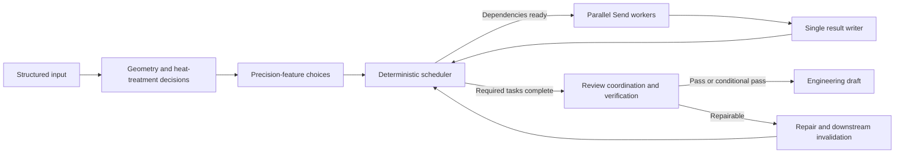
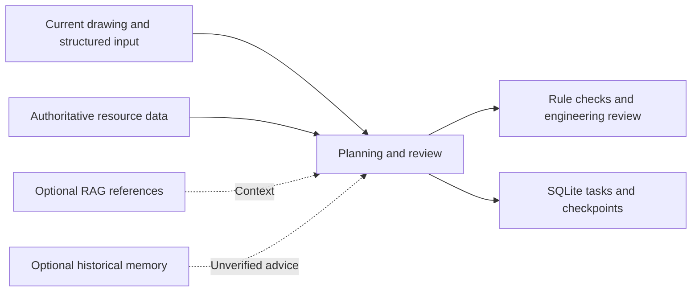

<p align="center">
  
</p>

<h1 align="center">shaftmachiningplanner</h1>
<p align="center"><strong>Machining process planning and resource verification for shaft components</strong></p>
<p align="center">A local workbench for structured part input, reviewable process routes, and traceable workflow execution.</p>

<p align="center">
  <a href="https://github.com/Taxueovo/Shaft-Machining-Planner/actions/workflows/ci.yml"></a>
  
  <a href="https://www.python.org/"></a>
  <a href="https://fastapi.tiangolo.com/"></a>
  
  <a href="LICENSE"></a>
</p>

<p align="center">
  <a href="#quick-start">Quick start</a> · <a href="#screenshots">Screenshots</a> · <a href="#architecture">Architecture</a> · <a href="#documentation">Documentation</a> · <a href="CHANGELOG.md">Changelog</a>
</p>

## Overview

shaftmachiningplanner converts material, blank geometry, shaft segments, tolerances, and feature locations into a machining process draft. A LangGraph workflow coordinates route generation, resource selection, specialist review, and deterministic verification. The local workbench provides task history, human input, route revisions, and Excel export.

| Part definition | Process planning | Resource verification | Engineering review |
| --- | --- | --- | --- |
| Solid or hollow blanks, shaft segments, tolerances, and located features | Rule-based baseline routes with optional model-assisted proposals | Machine and cutting-tool screening against public capability samples | Independent machining, quality, and heat-treatment reviews; editable drafts and exports |

Version 1.3.0 targets a loopback-only, single-process deployment. Process drafts require engineering review of drawings, workholding, machining parameters, inspection, and actual resource availability. ERP/MES integration, multi-user access control, and equipment execution are outside the current implementation.

## Features

- **Local workbench:** recent tasks, status filters, search, pagination, saved browser drafts, historical-input reuse, and system status.
- **Dependency-aware routing:** fixed core tasks, conditional workholding and alternative-resource analysis, parallel workers, and selective invalidation after repairs.
- **Human continuation:** validated process choices and engineering answers, persisted with LangGraph checkpoints.
- **Execution harness:** durable run identities, cumulative budgets, manifest validation, typed retries, queue admission, idempotent task creation, and cooperative cancellation.
- **Optional knowledge services:** RAG retrieval and a read-only TencentDB Agent Memory adapter, with memory disabled by default.
- **Evaluation tooling:** synthetic cases, failure reports, model-usage observations, and an opt-in GEPA prompt-candidate workflow.

## Screenshots

Screenshots show the Simplified Chinese interface with isolated synthetic tasks in rules mode. [Asset provenance](docs/assets/README.md) records the version and capture conditions.

### Workbench

Review recent tasks and pending questions, then start from a new form, a shaft preset, or saved input.


### Part input and task history

Define the blank, shaft segments, feature locations, and treatment requirements. Search previous tasks and reuse their original input for a new planning run.

<table>
  <tr><th>Structured part input</th><th>Task center</th></tr>
  <tr>
    <td></td>
    <td></td>
  </tr>
</table>

### Process route and resource candidates

Inspect operation order, review findings, and machine/tool coverage. Edited routes undergo resource matching and verification before a new revision is published.


### Execution records

Inspect cumulative node, model, tool, and active-time budgets across planning and route review. Run and invocation identifiers connect control events to the task record.


The illustrated run used zero planning-model requests in rules mode. Counters and timings describe that individual demonstration. See the [user guide](docs/software-guide.md) for status interpretation, cancellation, and backup procedures.

## Quick start

The core lockfiles and CI use **Python 3.10**. Optional RAG and prompt-optimization dependencies have separate lockfiles.

### Install

Run from the repository root:

```bash
python -m venv .venv
# macOS / Linux
source .venv/bin/activate
python -m pip install --require-hashes -r requirements.lock.txt
cp .env.example .env
```

For Windows PowerShell, use these activation and copy commands:

```powershell
.venv\Scripts\Activate.ps1
Copy-Item .env.example .env
```

A Conda environment is also available: `conda env create -f environment.yml`, followed by `conda activate shaftplanner`.

The example configuration selects rules mode:

```dotenv
LLM_PROVIDER=rules
AGENT_MEMORY_ENABLED=false
AUTO_SHUTDOWN_ON_IDLE=false
```

### Run

```bash
python start_shaftplanner.py
# Start services without opening a browser:
python start_shaftplanner.py --no-browser
```

| Service | Default address | Responsibility |
| --- | --- | --- |
| Workbench | <http://127.0.0.1:8000> | Pages, forms, polling, and authenticated local API proxy |
| Backend | <http://127.0.0.1:8001> | Input validation, workflow execution, resources, tasks, and checkpoints |

The launcher verifies service identity and readiness, and generates local API credentials. Services continue running after the browser closes. Stop them with Ctrl+C in the launch terminal or through System status. Separate frontend/backend startup requires a shared `LOCAL_API_TOKEN`; see the [user guide](docs/software-guide.md).

For a first run, open the workbench, create a plan, load the example, review its inputs, and submit. Inspect the result and execution record before exporting the Excel draft.

## Architecture


The frontend calls the backend over HTTP/JSON. SQLite stores task records and workflow checkpoints. The diagram summarizes component responsibilities; the [architecture reference](docs/langgraph-harness.md) documents routing, recovery, and publication contracts.


```mermaid
flowchart LR
  A[Structured input] --> B[Geometry and heat-treatment decisions]
  B --> C[Precision-feature choices]
  C --> D[Deterministic scheduler]
  D -->|Dependencies ready| E[Parallel Send workers]
  E --> F[Single result writer]
  F --> D
  D -->|Required tasks complete| G[Review coordination and verification]
  G -->|Pass or conditional pass| H[Engineering draft]
  G -->|Repairable| R[Repair and downstream invalidation]
  R --> D
```

### Scheduling and replanning

The core task set covers the process route, resources, machining review, quality review, and heat-treatment review. Workholding and alternative-resource analysis are added when part conditions or resource gaps require them.

| Trigger | Routing behavior |
| --- | --- |
| Worker completion or dependency advancement | Reuse the plan; the deterministic scheduler selects the next eligible batch |
| Initial planning, new resource infeasibility, repair-count changes, or new engineering answers | Request an optional Planner proposal; validate its contract and fall back to rules on failure |
| Route repair | Preserve the repaired proposal and invalidate affected resource/review outputs |
| Missing blocking information | Persist an interrupt; validate answers and checkpoint compatibility before resuming |
| Unknown actions, missing required outputs, or invalid verification verdicts | Record failure and reject successful completion |

### Runtime controls

Planning, human continuation, edited-route review, and offline evaluation use the same harness entry point.

| Control | Default or behavior |
| --- | --- |
| Nodes / model requests / tool calls | 128 / 32 / 256, cumulative across invocations |
| Active time / model request timeout | 300 seconds / 30 seconds; human waiting is excluded from active time |
| Model output / parallel workers | 4096 tokens per request / 4 workers |
| Pending-job limit | 32; human-waiting jobs are excluded |
| Continuation and deduplication | Atomic resume; matching input and Idempotency-Key return the existing job |
| Context and compatibility | prompt/memory snapshots and input, resource, configuration, and runtime identities |
| Stop and retry | Cooperative cancellation; bounded retries for classified transient failures |
| Observability | run_id, invocation_id, node traces, usage observations, and the latest 200 control events |

Budgets govern execution attempts and active time. Billing depends on provider usage, embeddings, and any separate optimization runs. In-flight calls finish or time out before cooperative cancellation completes. Runtime synchronization uses local locks and persistent active flags.

## Optional integrations

| Integration | Configuration | Responsibility |
| --- | --- | --- |
| Rules mode | `LLM_PROVIDER=rules` | Standalone core planning with deterministic proposals |
| Local model | `LLM_PROVIDER=local` and `LOCAL_MODEL_*` | Loopback OpenAI-compatible endpoint, such as local Ollama |
| Remote model | `LLM_PROVIDER=remote` and `OPENAI_*` | Send required input and context to the configured provider |
| RAG | `requirements-rag.lock.txt`, embedding configuration, and an index | Retrieve specification and case references |
| Tencent memory | Independently deployed service and `AGENT_MEMORY_*` | Read-only retrieval of unverified historical advice; disabled by default |
| prompt optimization | Separate optimization environment and explicit `--live` | Generate candidates for frozen-test evaluation and engineering review |

The [TencentDB-Agent-Memory](https://github.com/TencentCloud/TencentDB-Agent-Memory) adapter provides a historical-context service. SQLite continues to own task state, human interrupts, and checkpoints. A TencentDB PostgreSQL/MySQL migration would require a separate storage and concurrency design.

The first invocation saves prompt and memory snapshots; continuation and edited-route review reuse them. Current input and server rules take precedence over historical suggestions. Adapter contracts have been tested with simulated HTTP responses; live-service connectivity and retrieval quality remain pending.


```mermaid
flowchart LR
  A[Current drawing and structured input] --> P[Planning and review]
  R[Authoritative resource data] --> P
  K[Optional RAG references] -.Context.-> P
  M[Optional historical memory] -.Unverified advice.-> P
  P --> V[Rule checks and engineering review]
  P --> S[SQLite tasks and checkpoints]
```

See the [memory integration assessment](research/tencentdb-agent-memory-integration.md), [evaluation protocol](evaluation/README.md), and [industrial-agent roadmap](research/shaftmachiningplanner-industrial-agent-roadmap-2026-10-06.md).

## Configuration and data

Copy [.env.example](.env.example) to a local `.env` and restart after configuration changes. Keep credentials and business data outside Git.

| Group | Common settings |
| --- | --- |
| Services | `BACKEND_URL`, `FRONTEND_URL`, corresponding `*_PORT`, `LOCAL_API_TOKEN` |
| Task storage | `JOB_DB_FILE`; default `data/jobs.sqlite3` |
| Execution policy | `HARNESS_*`; existing runs retain their saved policy |
| Models | `LLM_PROVIDER`, `OPENAI_*`, `LOCAL_MODEL_*` |
| Retrieval and prompts | `EMBEDDING_*`, `AGENT_MEMORY_*`, `AGENT_PROMPT_PROFILE` |
| Shutdown | `AUTO_SHUTDOWN_ON_IDLE=false`, `HEARTBEAT_TIMEOUT=300` seconds |
| Export ingestion | `RAG_STORE_EXPORTS=false` |

Local tasks, case records, RAG documents/indexes, and `output/` are ignored by Git. Task history is capacity-limited; stop services before backing up the database and required exports. Retention and restore procedures are documented in the user guide.

### Public resource samples

- `data/machines.xlsx` records public manufacturer sources and review dates for preliminary size and capability screening. Samples include DMG MORI, KAPP NILES, and Gleason. Site inventory and availability require separate evidence.
- `data/tools.xlsx` records public ISCAR grade/material application data. Insert geometry, dimensions, tolerances, stock, cutting parameters, and holders require further confirmation.
- Missing coverage remains `not_covered` or an explicit review item. Source checks preserve engineering values; official references are recorded in the workbooks and `scripts/verify_public_sources.py`.

Model and embedding configurations determine where input and retrieved text are sent. Both application services bind to loopback; multi-user hosting requires additional authorization and deployment controls.

## Development and validation

Install the development dependencies, then run:

```bash
python -m pip install --require-hashes -r requirements-dev.lock.txt
python -m pytest backend/tests -q
python scripts/evaluate_agents.py --output output/evaluation/rules.json
ruff check backend frontend scripts start_shaftplanner.py
python scripts/release_audit.py
python scripts/scan_secrets.py
python scripts/verify_public_sources.py
```

Local validation recorded on **2026-10-07** for v1.3.0:

| Check | Result | Coverage |
| --- | --- | --- |
| Backend regression | 242 passed, 1 skipped | Execution budgets, continuation, cancellation, route review, and contracts; one existing deprecation warning |
| Synthetic rules evaluation | 11/11 passed | Expected behavior on synthetic inputs |
| Static and publication checks | Passed | Ruff, changed JavaScript syntax, release audit, credential scan, and public-source checks |
| Browser checks | Passed | New/legacy tasks, route revision, cumulative budgets, and cancellation |
| Live memory service, model-quality gains, factory feasibility | Pending | Requires service acceptance and engineering data |

The CI badge tracks `main`; branch validation is available on the corresponding pull request. Model-backed evaluation requires explicit `--live` and uses the configured provider. Engineering acceptance remains a separate review of the drawing, process, inspection, and site resources.

## Documentation

| Reference | Contents |
| --- | --- |
| [User guide](docs/software-guide.md) | Workbench operation, statuses, troubleshooting, backups, and upgrades |
| [Architecture and harness](docs/langgraph-harness.md) | Routing, contracts, budgets, checkpoints, and publication |
| [API reference](docs/api.md) | Local endpoints, request examples, and error handling |
| [Memory integration](research/tencentdb-agent-memory-integration.md) | Tencent adapter, deployment prerequisites, and acceptance sequence |
| [Evaluation](evaluation/README.md) | Synthetic cases, failure reports, and prompt candidates |
| [Industrial-agent roadmap](research/shaftmachiningplanner-industrial-agent-roadmap-2026-10-06.md) | Research evidence and staged integration priorities |
| [Changelog](CHANGELOG.md) · [Contributing](CONTRIBUTING.md) | Release history and development conventions |
| [Publication](PUBLICATION.md) · [Security](.github/SECURITY.md) | Public-release and security guidance |
| [Documentation assets](docs/assets/README.md) | Screenshot provenance and capture procedure |

## Repository layout

```text
shaftmachiningplanner/
├── backend/                 # APIs, rules, resources, and model clients
│   ├── agents/              # Planner, role contracts, and specialists
│   ├── workflow/            # Graph, scheduler, harness, and JobStore
│   ├── evaluation/          # Offline evaluation entry point
│   ├── models/ rules/ rag/  # Input contracts, rules, and optional retrieval
│   └── tests/               # Regression and fault-injection coverage
├── frontend/                # Jinja2 pages, JavaScript, and local HTTP proxy
├── data/                    # Public samples; private records are ignored
├── docs/                    # Guides, architecture, and screenshots
├── research/ evaluation/    # Assessments, synthetic cases, and profiles
├── scripts/                 # Evaluation, optimization, and release checks
├── output/                  # Ignored exports and evaluation reports
├── product.json             # Product name and version
├── .env.example             # Configuration template
└── start_shaftplanner.py    # Local launcher
```

## License

Maintained by **Taxueovo**. Licensed under the [MIT License](LICENSE).
