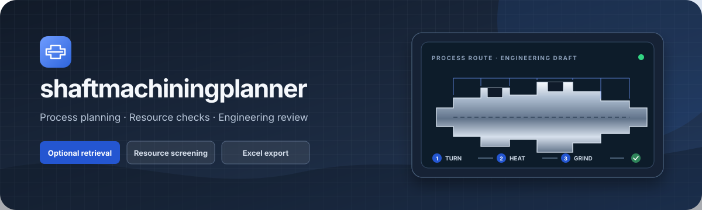
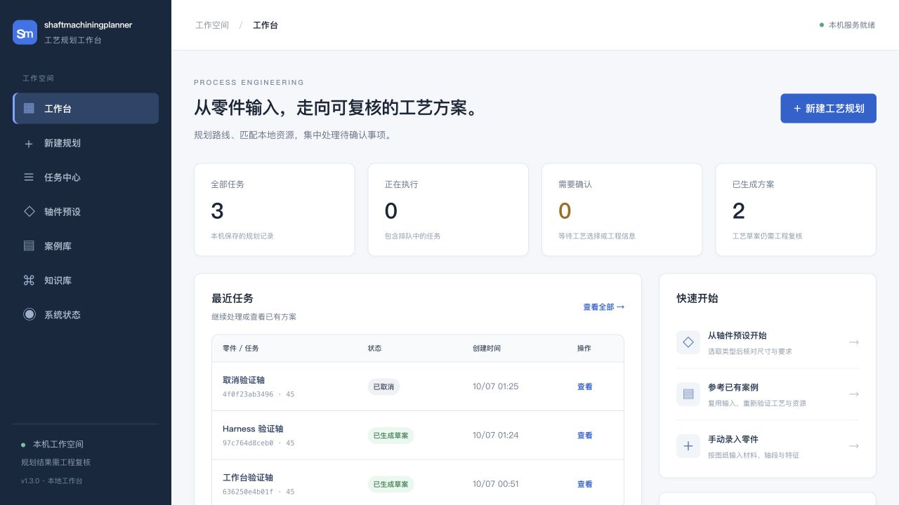
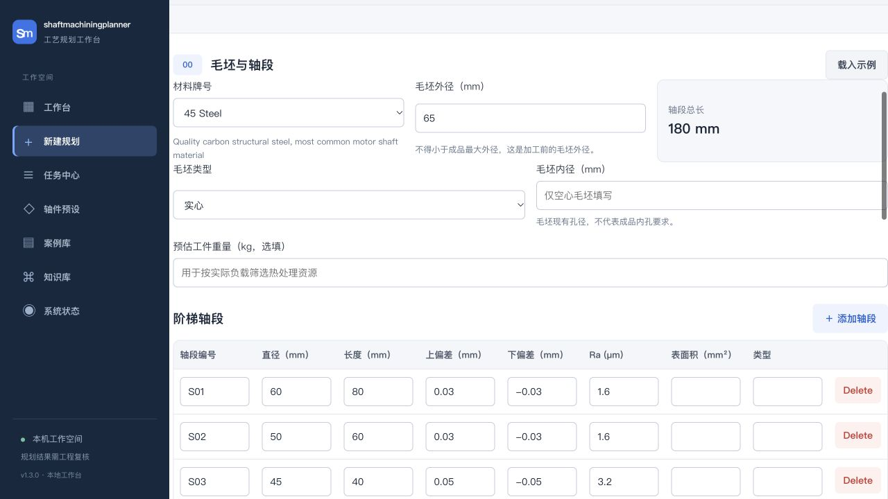
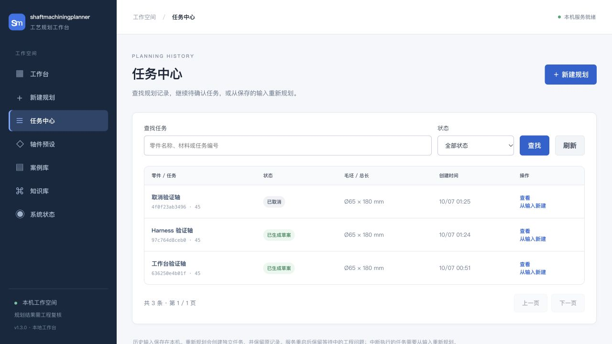
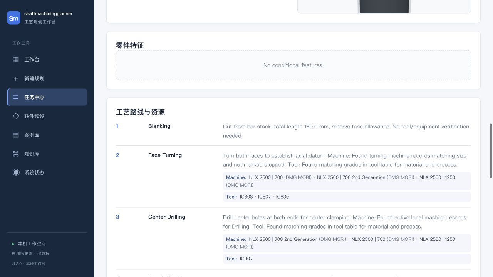
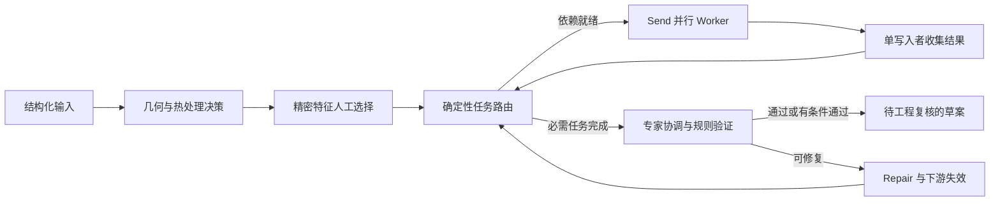
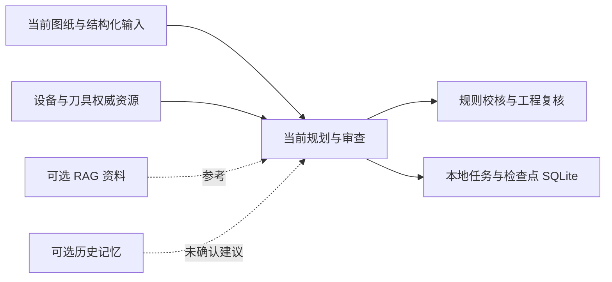

<p align="center">
  
</p>

<h1 align="center">shaftmachiningplanner</h1>
<p align="center"><strong>轴类零件工艺规划与资源校核 · v1.3.0 本地工作台</strong></p>
<p align="center">把材料、轴段和特征转为可追溯的工艺草案，集中处理资源缺口、人工确认和执行故障。</p>

<p align="center">
  <a href="https://github.com/Taxueovo/Shaft-Machining-Planner/actions/workflows/ci.yml"></a>
  
  <a href="https://www.python.org/"></a>
  <a href="https://fastapi.tiangolo.com/"></a>
  
  <a href="LICENSE"></a>
</p>

<p align="center">
  <a href="#快速开始">快速开始</a> · <a href="#界面与操作">界面与操作</a> · <a href="#架构与路由">架构与路由</a> · <a href="#文档导航">完整文档</a> · <a href="CHANGELOG.md">更新记录</a>
</p>

> 当前为本机单进程工程辅助软件。输出是需复核的工艺草案，资源样例匹配与规则通过不构成生产放行。截图来自规则模式下的合成演示任务，不含真实工厂图纸或业务数据。CI 徽标显示 `main`，升级分支的验证结果请查看对应 PR。

## 项目解决什么问题

轴件规划需要把图纸要求、加工顺序、热处理、设备能力和检验要求连接起来。shaftmachiningplanner 将这些判断放在同一条可检查的流程中：

| 输入与建模 | 工艺编排 | 资源与审查 | 复核与交付 |
| --- | --- | --- | --- |
| 材料、实心 / 空心毛坯、轴段、公差与特征位置 | 规则生成基础路线，可选模型提出受限修改 | 机床 / 刀具样例筛查，加工、质量与热处理独立审查 | 人工补充信息，编辑再校核，导出 Excel 工艺草案 |

适合演示轴类零件的规划链路、验证工艺规则、研究受约束的工业 Agent，以及让工程师集中查看方案中的缺口。当前没有 ERP / MES 连接、多用户账户、完整成本核算或现场设备控制。

## 界面与操作

### 1. 从工作台进入任务

查看最近任务、待确认事项和运行模式，选择手动录入、轴件预设或历史输入作为起点。



### 2. 核对输入，再提交规划

输入材料、毛坯、轴段与特征；位置支持段内偏移或全局坐标。重量、表面处理、批量和热处理要求随请求保存。浏览器草稿需要主动保存；路线预览不等于最终复核结果。

<table>
  <tr><th>结构化零件输入</th><th>任务中心与历史复用</th></tr>
  <tr>
    <td></td>
    <td></td>
  </tr>
</table>

### 3. 检查工程结论和资源候选

结果页展示规则结论、专家意见、工序与设备 / 刀具候选。`conditional_pass` 表示仍有条件或未解决事项需要确认。修改路线后先重新匹配资源并复核，成功才发布新修订。



### 4. 查看执行预算和故障证据

展开“运行控制、预算与故障记录”，查看跨人工恢复、路线复核累计的节点、模型请求和工具预算。排队、执行和等待人工的任务可以取消；原输入与记录保留。


截图中的模型请求数为零，因为该演示使用规则模式；缺失 Token 观测会显示“未完整观测”。每个数字仅描述该条演示记录。完整操作、状态解读与排错见 [图文使用指南](docs/software-guide.md)。

## 快速开始

以下流程以 **Python 3.10** 为验证环境，核心安装无需模型或腾讯数据库。RAG 与提示词优化分别使用可选依赖。

### 安装与启动

在仓库根目录执行：

```bash
python -m venv .venv
# macOS / Linux
source .venv/bin/activate
python -m pip install --require-hashes -r requirements.lock.txt
cp .env.example .env
```

Windows PowerShell 使用以下激活与复制命令，其他 Python 命令相同：

```powershell
.venv\Scripts\Activate.ps1
Copy-Item .env.example .env
```

也可使用 Conda：`conda env create -f environment.yml`，然后 `conda activate shaftplanner`。

示例配置采用规则模式，外部记忆默认关闭：

```dotenv
LLM_PROVIDER=rules
AGENT_MEMORY_ENABLED=false
AUTO_SHUTDOWN_ON_IDLE=false
```

```bash
python start_shaftplanner.py
# 自行打开浏览器时：
python start_shaftplanner.py --no-browser
```

| 服务 | 默认地址 | 职责 |
| --- | --- | --- |
| 工作台 | <http://127.0.0.1:8000> | 页面、表单、轮询与本机 API 代理 |
| 后端 | <http://127.0.0.1:8001> | 业务校验、LangGraph、资源、任务与检查点 |

启动器检查服务身份和就绪状态，并生成本机 API 凭据。关闭浏览器后服务默认继续运行；可在启动终端按 Ctrl+C，或通过“系统状态”停止。直接运行前后端时需配置同一份 `LOCAL_API_TOKEN`，详见使用指南。

**首次体验：** 工作台 → 新建规划 → 载入示例 → 核对并提交 → 查看草案 → 展开运行控制 → 导出 Excel。示例只是合成输入，没有真实图纸时不应将它当成已确认的制造任务。

## 架构与路由


这是职责分层示意；真实节点与边见 [LangGraph / Harness 架构](docs/langgraph-harness.md)。前端通过 HTTP/JSON 调用后端，执行恢复与任务记录保存于本地 SQLite。


```mermaid
flowchart LR
  A[结构化输入] --> B[几何与热处理决策]
  B --> C[精密特征人工选择]
  C --> D[确定性任务路由]
  D -->|依赖就绪| E[Send 并行 Worker]
  E --> F[单写入者收集结果]
  F --> D
  D -->|必需任务完成| G[专家协调与规则验证]
  G -->|通过或有条件通过| H[待工程复核的草案]
  G -->|可修复| R[Repair 与下游失效]
  R --> D
```

### 为什么不是每一轮都让模型调度

固定核心任务包括工艺路线、资源选择、加工审查、质量审查和热处理审查。装夹与替代资源分析依据零件条件或缺口追加。

| 场景 | 路由行为 |
| --- | --- |
| 普通 Worker 完成、依赖推进 | 复用计划，由确定性调度器选择下一批任务 |
| 首次计划、资源不可行的新证据、Repair 次数或工程回答变化 | 可选 Planner 重新提出计划；合同校验失败时回退规则 |
| 路线修复 | 保留新路线，使受影响的资源与审查结果失效并重跑 |
| 缺少阻塞工程信息 | `interrupt` 等待；校验回答与检查点后恢复 |
| 未知动作、缺必需产物或无有效验证结论 | 拒绝进入成功路径，保留失败证据 |

### Harness 提供什么

Harness 是图执行外围的运行控制层。在线规划、人工恢复、路线编辑复核与离线评测使用同一控制入口。

| 控制项 | 默认值 / 行为 |
| --- | --- |
| 节点 / 模型请求 / 工具调用 | 128 / 32 / 256，跨恢复累计 |
| 活动时间 / 单次模型超时 | 300 秒 / 30 秒；等待人工不计入活动时间 |
| 单次模型输出 / 并行 Worker | 4096 Token / 最多 4 个 |
| 执行队列上限 | 32；等待人工的任务不占执行队列额度 |
| 恢复与幂等 | 原子恢复；同一 Idempotency-Key 与输入返回已有任务 |
| 版本与上下文 | 保存 Prompt 和记忆快照，比对输入、资源与运行身份 |
| 停止与重试 | 协作式取消；只对限定的暂时性故障重试 |
| 可观察性 | run_id、invocation_id、Trace、最近 200 个控制事件与故障类别 |

这些上限不等于总账单费用上限。取消不会强行杀死线程，在途调用可能需要等待超时；当前没有分布式租约或强制进程沙箱。

## 模型、知识库与腾讯记忆

| 能力 | 如何启用 | 数据与职责 |
| --- | --- | --- |
| 规则模式 | `LLM_PROVIDER=rules` | 工艺规划可独立运行，不调用规划模型 |
| 本机模型 | `LLM_PROVIDER=local` + `LOCAL_MODEL_*` | loopback OpenAI 兼容接口，如本机 Ollama |
| 远程模型 | `LLM_PROVIDER=remote` + `OPENAI_*` | 发送所需输入与上下文到配置的服务商 |
| RAG | 安装 `requirements-rag.lock.txt`，配置 Embedding 并建索引 | 资料 / 案例检索；缺模块或资料时没有知识增强证据 |
| 腾讯记忆 | 独立部署上游，配置 `AGENT_MEMORY_*` | 只读检索未确认历史经验，默认关闭 |
| Prompt 优化 | 独立优化环境，显式 `--live` | 产生候选，冻结测试与工程复核后才可启用 |

腾讯接入的是 [TencentDB-Agent-Memory](https://github.com/TencentCloud/TencentDB-Agent-Memory) 的记忆服务接口，**不代表已迁移到腾讯云业务数据库**。任务、人工等待与检查点仍存本机 SQLite。

首次执行保存 Prompt 和记忆快照，人工恢复和路线编辑沿用原快照。历史建议不能覆盖当前图纸、资源规则或审批；适配器已用模拟服务验证，真实腾讯服务尚未验收。


```mermaid
flowchart LR
  A[当前图纸与结构化输入] --> P[当前规划与审查]
  R[设备与刀具权威资源] --> P
  K[可选 RAG 资料] -.参考.-> P
  M[可选历史记忆] -.未确认建议.-> P
  P --> V[规则校核与工程复核]
  P --> S[本地任务与检查点 SQLite]
```

见 [腾讯记忆接入说明](research/tencentdb-agent-memory-integration.md)、[评测与候选优化](evaluation/README.md) 和 [工业 Agent 技术路线](research/shaftmachiningplanner-industrial-agent-roadmap-2026-10-06.md)。

## 配置与数据保留

完整模板见 [.env.example](.env.example)。写入本机 `.env` 后重启；真实密钥与业务数据不应加入 Git。

| 配置组 | 常用字段 |
| --- | --- |
| 本机服务 | `BACKEND_URL`、`FRONTEND_URL`、对应 `*_PORT`、`LOCAL_API_TOKEN` |
| 任务保存 | `JOB_DB_FILE`，默认 `data/jobs.sqlite3` |
| 运行策略 | `HARNESS_*`；已开始任务沿用保存的策略 |
| 模型 | `LLM_PROVIDER`、`OPENAI_*`、`LOCAL_MODEL_*` |
| 知识与经验 | `EMBEDDING_*`、`AGENT_MEMORY_*`、`AGENT_PROMPT_PROFILE` |
| 服务退出 | `AUTO_SHUTDOWN_ON_IDLE=false`；`HEARTBEAT_TIMEOUT=300` 秒 |
| 导出入库 | `RAG_STORE_EXPORTS=false` |

本机任务、案例、RAG 文档 / 索引和 `output/` 由 Git 忽略。数据库历史有清理上限，正式归档应在停止服务后备份数据库与导出文件，见使用指南。

### 公共资源样例的含义

- `data/machines.xlsx`：厂家公开来源及核对日期，用于尺寸、状态与已公开能力粗筛。包含 DMG MORI、KAPP NILES、Gleason 样例，不含客户资产、价格、序列号或现场可用性。
- `data/tools.xlsx`：ISCAR 公共牌号 / 材料应用信息。不能据此确认刀片几何、尺寸、公差能力、库存、参数或刀柄。
- 缺失能力保留 `not_covered` 或待确认项。自动源检查不应直接覆写工程值。官方来源详见工作簿与 `scripts/verify_public_sources.py`。

模型或 Embedding 启用后，部分输入与检索文本会发送到配置的提供方。两项服务只允许 loopback 监听；当前版本不适合公开代理成多用户服务。

## 验证与工程边界

2026-10-07，v1.3.0 的本地验证记录：

| 检查 | 结果 | 证据范围 |
| --- | --- | --- |
| 后端回归 | 242 通过，1 跳过 | 执行、预算、恢复、取消、编辑复核与合同；有一条现有弃用警告 |
| 合成规则案例 | 11 / 11 通过 | 规则行为；不是 11 个真实工厂案例 |
| 静态与发布检查 | 通过 | Ruff、修改后的 JS 语法、发布审计、凭据扫描与公共源检查 |
| 本机界面验证 | 通过 | 新旧任务、路线复核、预算累计与取消 |
| 腾讯实连 / 真实模型增益 / 现场制造 | 未验证 | 不据此宣称效率提升或生产可行性 |

开发验证：

```bash
python -m pip install --require-hashes -r requirements-dev.lock.txt
python -m pytest backend/tests -q
python scripts/evaluate_agents.py --output output/evaluation/rules.json
ruff check backend frontend scripts start_shaftplanner.py
python scripts/release_audit.py
python scripts/scan_secrets.py
python scripts/verify_public_sources.py
```

真实模型评测必须显式选择 `--live`，会使用配置的模型服务。评测结果不应替代工程师对图纸、装夹、加工参数、检验与现场资源的核实。

## 文档导航

| 我想了解 | 从这里开始 |
| --- | --- |
| 操作、状态、排错、备份和升级 | [图文使用指南](docs/software-guide.md) |
| 节点、条件路由、预算与恢复 | [LangGraph / Harness 架构](docs/langgraph-harness.md) |
| 本机 API、请求示例与错误处理 | [API 速查](docs/api.md) |
| 腾讯记忆是否适合、如何部署和验收 | [接入评估](research/tencentdb-agent-memory-integration.md) |
| badcase、评测与 Prompt 优化候选 | [评测说明](evaluation/README.md) |
| 工业 Agent 技术与分阶段路线 | [技术路线](research/shaftmachiningplanner-industrial-agent-roadmap-2026-10-06.md) |
| 版本变更与参与开发 | [CHANGELOG](CHANGELOG.md) · [CONTRIBUTING](CONTRIBUTING.md) |
| 公开发布与安全边界 | [PUBLICATION](PUBLICATION.md) · [SECURITY](.github/SECURITY.md) |
| 截图来源与复拍说明 | [文档资源说明](docs/assets/README.md) |

## 目录与维护

```text
shaftmachiningplanner/
├── backend/                 # 业务 API、规则、资源与模型调用
│   ├── agents/              # Planner、角色合同、专家与协调
│   ├── workflow/            # 图、调度、运行 Harness、JobStore
│   ├── evaluation/          # 离线评测入口
│   ├── models/ rules/ rag/  # 输入合同、规则、可选知识检索
│   └── tests/               # 回归与故障注入
├── frontend/                # Jinja2、JS 与本机 HTTP 代理
├── data/                    # 公共能力样例；私有记录由 Git 忽略
├── docs/                    # 使用说明、架构图和演示截图
├── research/ evaluation/    # 接入评估、合成案例与候选配置
├── scripts/                 # 评测、优化与发布审计
├── output/                  # 导出与评测产物，由 Git 忽略
├── product.json             # 产品名与版本
├── .env.example             # 无真实凭据的配置模板
└── start_shaftplanner.py    # 启动入口
```

主要维护者：**Taxueovo**。项目采用 [MIT License](LICENSE)。欢迎提交带有输入、预期行为和可复现证据的缺陷报告与改进建议。
