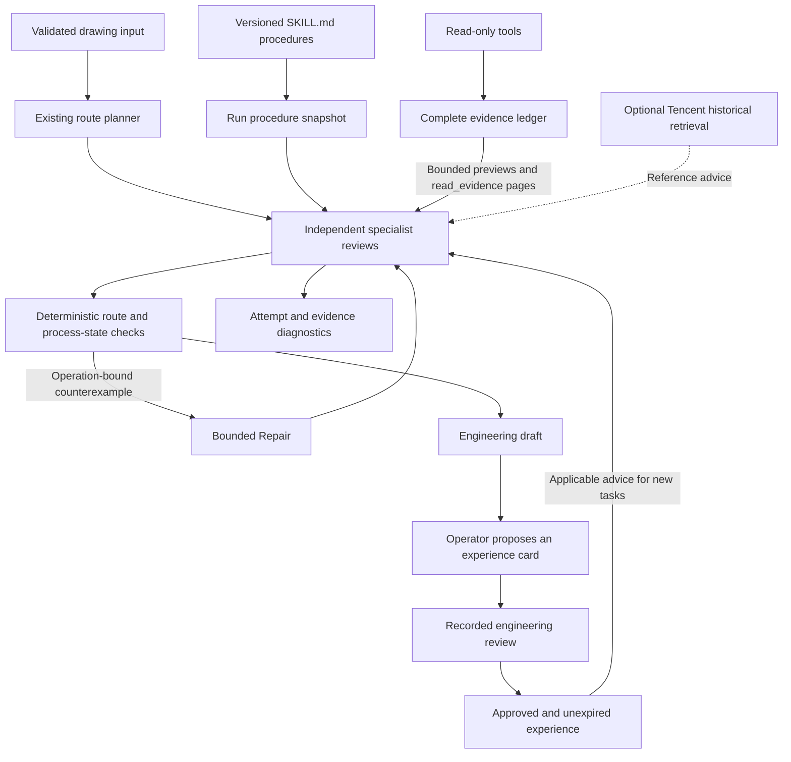
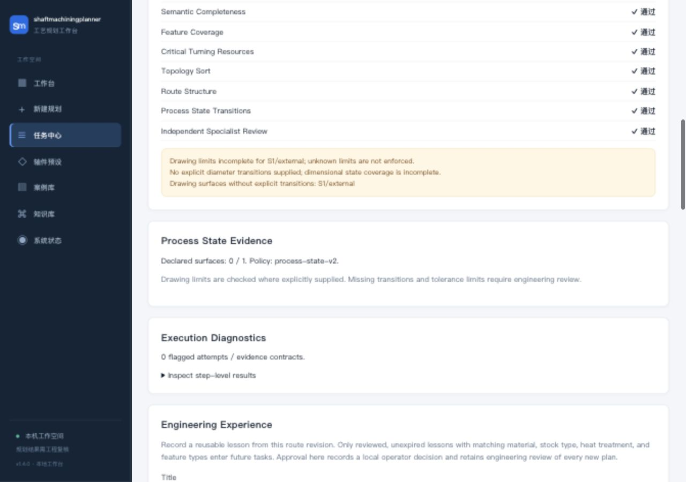
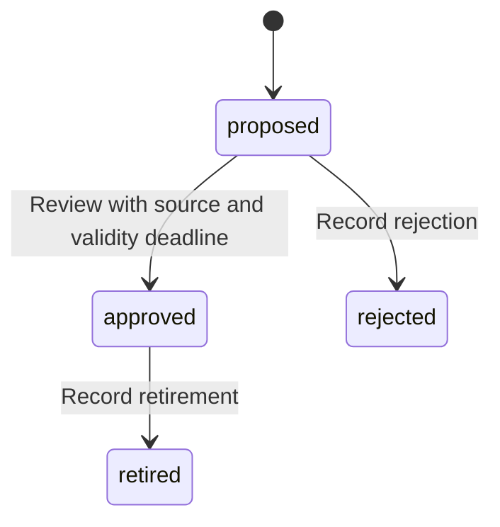
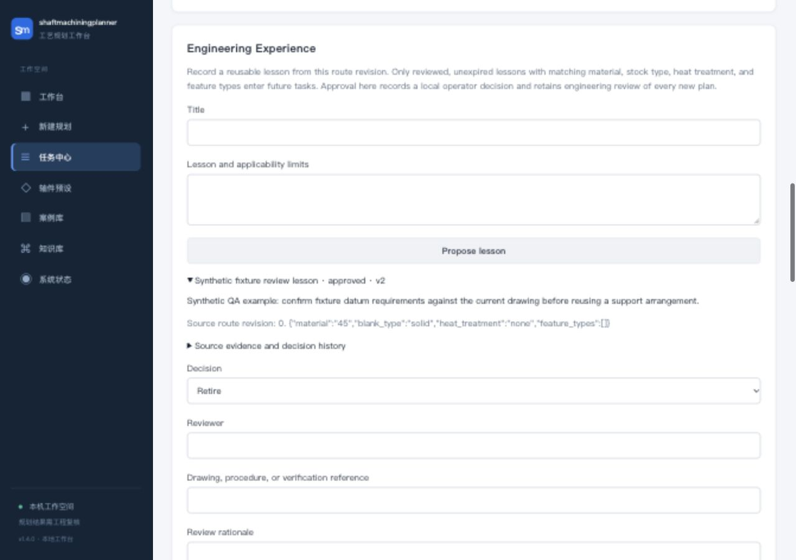

# Engineering agent extensions

Version 1.4.0 adds procedure packages, bounded evidence context, process-state counterexamples, reviewed experience, and deterministic trace grading to the existing LangGraph workflow. These components run with the core dependencies in `requirements.lock.txt`.

## Procedure packages

The `engineering_skills/` directory contains machining, quality, and heat-treatment review procedures. Each package has an Agent Skills-style `SKILL.md` with name, description, and version metadata. Only the selected role's instructions enter its specialist prompt. The complete catalog is saved once per job with content checksums; continuation and edited-route review reuse the saved contents.

The loader uses a fixed set of shipped packages. It reads review instructions and does not execute scripts, discover arbitrary directories, or change task permissions. Maintain versions through source review. New tasks use current packages; existing jobs retain their original snapshot. Procedure changes also invalidate demonstration-cache keys and evaluation comparisons.

## Evidence context

Each specialist owns an evidence ledger containing current input, route, heat-treatment decision, task contract, dependency results, historical advice, procedure identity, and acquired tool results. Complete records remain in the specialist report and persisted task result. The report includes an evidence manifest with checksums and character counts.

- Current input, route, decision, and task contract remain complete.
- Each other record above 6,000 characters receives a valid JSON preview with explicit omission markers and a retrieval descriptor.
- `read_evidence` reads only records acquired by the current specialist. Dictionary-key paths select a field; list pages use item offsets and limits. Text pages use character offsets and blocks of 600 characters.
- Pages above 6,000 characters require a narrower path or smaller limit.
- The model-visible evidence map is limited to 48,000 characters. An oversized protected record produces a degraded model review with deterministic findings retained.
- The existing three-turn, four-tool-request limit and task-specific permissions remain in effect. Paging consumes tool budget.

Each turn reconstructs its evidence map from the ledger, avoiding repeated copies of previous tool outputs. Character limits bound evidence payloads; model token consumption depends on the tokenizer and additional instructions. Reference-only authority follows paged records, so assigning a tool identifier to historical advice cannot authorize a route repair.

## Process-state counterexamples

`process-state-v2` checks declared transitions against stock, object and surface identity, material-removal direction, explicit state continuity, treatment/datum recovery, inspection order, and packaging prerequisites. It adds two drawing checks:

| Constraint | Trigger | Response |
| --- | --- | --- |
| `DRAWING_MATERIAL_OVERCUT` | An external diameter is cut below an explicitly supplied lower drawing limit | Reject the declared transition and identify the affected operation/surface |
| `FINAL_DIAMETER_OUTSIDE_DRAWING` | A declared diameter at final inspection lies outside supplied limits | Reject the final state and report expected limits and actual size |

For example, an input diameter of 30 mm with deviations of -0.01/+0.02 mm and a declared result of 29.98 mm yields a lower-limit counterexample at 29.99 mm. Unknown deviations remain unknown; nominal bore dimensions currently lack explicit deviation fields. Missing dimension transitions and acceptance limits appear as coverage warnings.

Counterexamples carry constraint IDs, operation numbers, preceding-operation references, state before the operation, and source evidence IDs. Dimensional examples include expected and actual values. Repair receives these structured records, and candidate routes undergo the same deterministic checks. This model checks declared planning states; cutting physics, fixture deformation, furnace capability, and site acceptance require separate evidence.

## Reviewed experience

The result page provides an **Engineering Experience** panel. Propose a lesson from the displayed route, inspect the captured source, and record a decision with reviewer, source reference, rationale, and future validity deadline for approval.

Cards live in the `engineering_experiences` table in the task SQLite database, independently of task retention. Source data captures the job ID, route revision/fingerprint, input digest, findings, counterexamples, and procedure-catalog digest. Version checks prevent concurrent review overwrites. Approval rejects a changed source route. Reviewer identity is supplied by the authenticated local operator; the current deployment has no enterprise identity or role separation.

New jobs retrieve at most three approved, unexpired lessons with matching material, blank type, treatment, and feature-type set. Matching is conservative screening; the reviewer must still examine dimensions, tolerances, and other applicability limits. The combined local/Tencent reference list retains the 6,000-character budget. Existing jobs reuse their original snapshot through continuation and edited-route review. Retirement affects subsequent retrieval and leaves prior evidence records intact.

Tencent retrieval remains optional and read-only. The local review workflow makes no remote writes. A future Tencent synchronization adapter needs an explicit remote contract, identity mapping, and acceptance tests. Back up the SQLite database to preserve reviewed cards and decision history.

## Trace grading

The result API and offline evaluation include `trace_grading`. Deterministic diagnostics preserve failed, unfinished, or interrupted node attempts, observed model-call failures, degraded reviews, stale route references, unacquired citations, and missing model-review procedure identity. Evaluation feedback also includes constraint counterexamples.

These checks complement engineer-reviewed evaluation cases. A passing diagnostic confirms execution/evidence contracts within its stated scope. Real-model quality, latency, cost improvement, and factory feasibility remain unmeasured.

## Design sources

The implementation adapts the following published design ideas through project-specific components:

| Source | Adopted idea |
| --- | --- |
| [Deep Agents v0.7](https://www.langchain.com/blog/deep-agents-v0-7) | Lean role context, explicit context bounds, addressable long tool outputs |
| [Agent Skills](https://github.com/agentskills/agentskills) | Versioned procedural knowledge loaded for the relevant task |
| [MP-OPT](https://github.com/rwth-iat/MP-OPT) | Explicit process legality and infeasibility evidence, adapted to declared shaft states |
| [ACE](https://github.com/ace-agent/ace) and [ReMe](https://github.com/agentscope-ai/ReMe) | Source-linked, incremental experience records with reviewable provenance |
| [Trace grading](https://developers.openai.com/api/docs/guides/trace-grading) | Inspect execution decisions and evidence contracts alongside final results |
| [SemaPLC](https://github.com/midea-ai/SemaPLC) | Gate completion on checkable verification evidence |

External frameworks, mixed-integer solvers, A2A services, and PLC runtime execution are not runtime dependencies of this release. Their adoption requires corresponding domain models and integration requirements.
