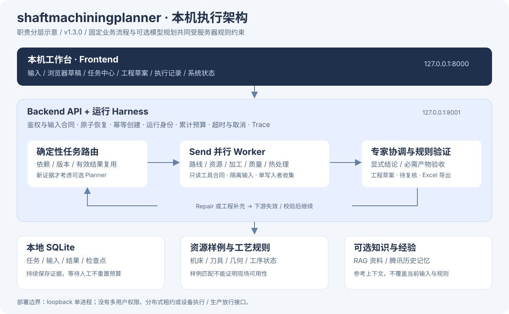
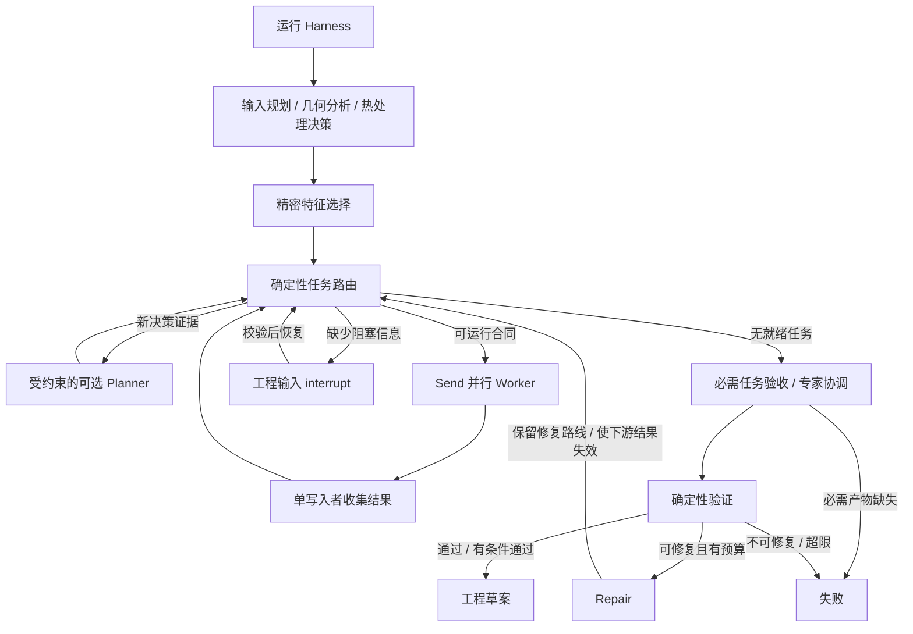
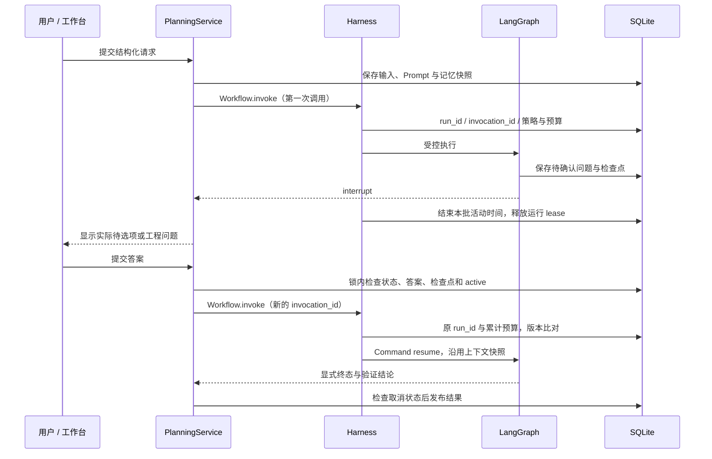
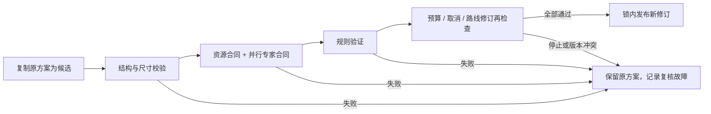
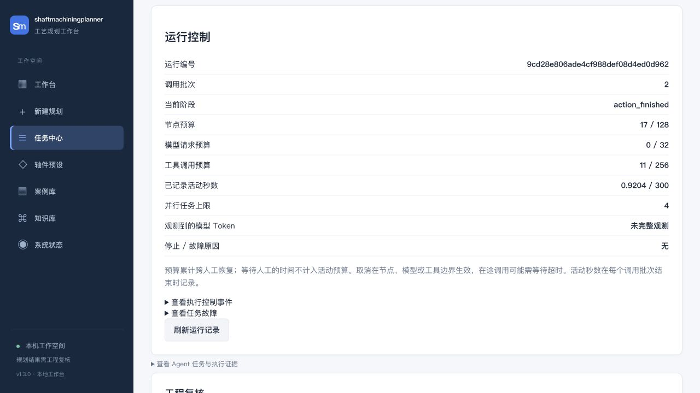

# shaftmachiningplanner：LangGraph 路由与运行 Harness

版本 1.3.0。这套架构面向本机单进程的轴件规划。工艺规则和验收由服务端控制，模型只能在限定合同内提出路线修改、调度和审查建议。



分层图用于快速理解组件职责；以下 Mermaid 图对应图与调度的控制关系。

## 图的职责



图中固定的五类核心任务仍是路线、资源、加工审查、质量审查、热处理审查。装夹与替代资源分析按零件条件和缺口追加。单写入者发布共享业务状态，Worker 在隔离输入上执行，只返回其结果槽。

本版的优化：

- **按证据变化介入模型。** 首次任务计划、资源不可行的新证据、路线修复次数变化、工程回答变化才重新考虑模型计划；普通 Worker 完成和调度推进复用计划。同一证据下模型计划失败也不逐轮反复请求。模型规划仍最多 4 次，调度最多 16 波。
- **收窄 Send 输入。** Worker 只接收业务输入、自己的依赖产物与必要路线状态；不复制全局 Trace、调度历史和兄弟审查报告。自己的上次尝试记录单独放在信封中，保证精简状态后重试计数仍正确。
- **保留版本失效逻辑。** 合同、输入、路线、上游产物、资源及运行身份共同决定结果版本。Repair 的路线作为新提案保留，重跑受影响的资源和审查，避免生成器覆盖修复。
- **明确结束条件。** 未知调度动作、没有就绪任务的分发、缺少显式验证结论均不会进入成功路径。模型总结不能替代必需任务和规则校核。

## Harness 的执行边界

服务与离线评测统一使用 `Workflow.invoke()`，内部才调用编译图。路线编辑复核也使用同一份持久化运行预算及只读 Worker 合同，在发布修改前再检查运行控制。

### 人工中断如何恢复



`lease` 是本机持久化 active 标记与线程锁控制，不是多实例或跨机器租约。工程等待结束后新开调用批次，但没有刷新任务的预算、Prompt 或历史记忆。

### 路线编辑如何避免覆盖有效方案



| 能力 | 当前实现 |
| --- | --- |
| 运行身份 | 持久化 run_id；每次首次执行、人工恢复或路线复核有独立 invocation_id，Trace 关联这两个编号 |
| 版本绑定 | 输入摘要、模型配置身份、Prompt 摘要、资源文件哈希、流水线 / Harness 版本；恢复前比对，不同版本拒绝沿旧状态继续 |
| 输入上下文 | 首次执行保存 Prompt 内容快照和历史记忆快照；恢复使用原快照，不重新取一套历史建议 |
| 全局预算 | 节点 / 复核入口、模型请求、工具调用、活动时间跨恢复累计；并行线程在同一锁内预留预算 |
| 模型控制 | 限制单次超时与输出 Token 上限，SDK 隐式重试关闭；JSON 格式兼容回退算一次新的请求 |
| 工具权限 | 角色白名单、合同权限子集与任务局部预算；实际只读查询、引用检索和路线检查均经过预算入口 |
| 重试 | 传输超时、连接故障和特定服务端 / 限流错误最多两次尝试；参数、验证和权限错误不重试 |
| 人工恢复 | 在锁内验证等待状态、实际待选项 / 待回答任务及检查点；重复请求不能提交两个恢复；队列提交失败恢复等待状态 |
| 请求去重 | 创建接口接受 Idempotency-Key；相同键与相同输入返回已有记录，不同输入冲突；浏览器网络重试复用该键 |
| 取消 | 排队、运行、人工等待可取消；边界检查终止后续执行，禁止迟到结果覆盖取消状态；保留原输入与证据 |
| 故障证据 | 持久化控制事件（最近 200 条）、每节点 Trace、Worker 错误类别 / 重试性、模型使用观测；失败路线编辑也留记录 |
| 评测 | 同一执行 Harness 跑合成案例，预算停止生成可检查 badcase；候选比较和工程复核门槛保留，不自动启用候选 |

资源仓储绑定启动时的文件版本。文件变化后需要重启软件，新建任务使用新资源；已有运行还需通过其原版本比对。用户主动路线编辑的失败只增加观测记录，不发布无效路线或改写原方案。

## 默认预算

以下值可通过 `.env` 中同名的 `HARNESS_` 配置修改。已开始任务使用保存的策略，人工恢复不会重新获得额度。

| 配置 | 默认值 |
| --- | ---: |
| HARNESS_MAX_NODES | 128 |
| HARNESS_MAX_MODEL_CALLS | 32 |
| HARNESS_MAX_TOOL_CALLS | 256 |
| HARNESS_MAX_ACTIVE_SECONDS | 300 秒 |
| HARNESS_MODEL_TIMEOUT_SECONDS | 30 秒 |
| HARNESS_MODEL_OUTPUT_TOKENS | 4096 |
| HARNESS_MAX_PARALLEL_TASKS | 4 |
| HARNESS_MAX_PENDING_JOBS | 32 |

队列上限统计排队、执行和取消中的任务，等待人工的任务不占执行队列额度。Idempotency-Key 的去重有效期跟随本机任务记录；旧记录被容量清理后不能继续依赖其去重。

活动时间是图执行 / 路线复核各批次的墙钟时间，包含其在途调用，排队和等待人工不计入。时间限制与取消是**协作式边界控制**：不会强行杀死 Python 线程；在途模型调用可能需等待超时，阻塞的本地函数仍需返回才能检查。外部记忆初始化和 RAG 索引构建不属于这份规划图预算。

模型请求预算统计预留的请求尝试；服务商实际 Token 和费用不能仅由次数推断。输出上限也不是整段输入、Embedding 或账单 Token 的硬上限。无法取得使用量时仍显示未完整观测，不填造零费用或零 Token。

## 查看与验证

任务详情展开“运行控制、预算与故障记录”，可查看上限、累计使用数、调用批次、事件和故障。旧记录或显式演示缓存没有新的运行控制记录时，页面会说明。



示例图在两次调用后仍保留同一 run_id，节点与工具次数继续累计。它验证记录与控制行为，不是模型效率或生产效果的对比图。

本地鉴权接口：

完整接口表、合成请求和错误处理见 [本机 API 速查](api.md)。

- `GET /api/v1/jobs/{job_id}/harness`：运行记录、模型使用观测和故障摘要。
- `POST /api/v1/jobs/{job_id}/cancel`：请求协作式取消；重复取消返回当前状态。
- `POST /api/v1/jobs`，可选 `Idempotency-Key` 请求头：幂等创建。

```bash
python -m pytest -q
python scripts/evaluate_agents.py --output output/evaluation/harness-rules.json
```

回归涵盖真实图的并行预算、有限重试、取消竞态、恢复计数、队列回滚、输入去重、配置变化、路线编辑失败和 badcase 生成。默认评测使用规则模式且关闭外部记忆；模型边界测试使用替身客户端，不发送付费请求。

2026-10-07 本地验证：242 项测试通过、1 项跳过；11 / 11 合成规则案例通过。Ruff、修改后的 JavaScript 语法、发布树审计与凭据扫描通过。浏览器实测新任务预算、旧任务兼容、路线复核发布及人工等待任务取消。另有一条现有 Starlette / httpx 弃用警告。

当前证据验证执行行为，不证明真实模型效果提高或现场制造可行。这里没有分布式租约、跨机器执行、强制进程沙箱或厂级审批服务；SQLite 和本地锁仅支持当前单进程部署。
