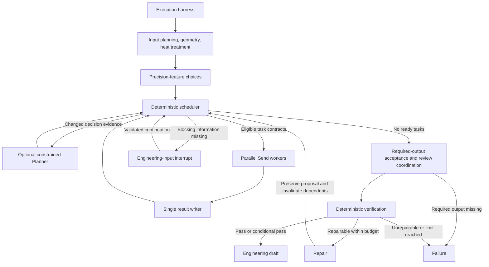
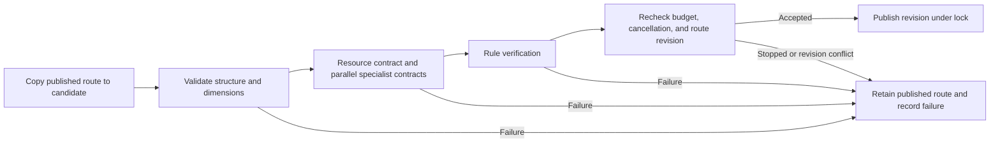

# LangGraph architecture and execution harness

Version 1.4.0. shaftmachiningplanner runs a local, single-process workflow. Server-side rules and task contracts govern process acceptance. Models operate within bounded planning and review roles.


## Workflow and routing



The fixed core tasks are route generation, resource selection, machining review, quality review, and heat-treatment review. Workholding and alternative-resource analysis are conditional tasks. Workers receive isolated inputs and return their own result slots; a single writer publishes shared business state.

### Scheduling and result validity

- **Evidence-triggered replanning.** Initial planning, new resource infeasibility, changed repair counts, and new engineering answers can trigger Planner intervention. Ordinary worker completion advances the deterministic schedule using the existing plan. A failed Planner proposal is not repeatedly requested for unchanged evidence. Limits remain four Planner calls and sixteen scheduler waves.
- **Narrow worker envelopes.** Each `Send` payload contains business input, required dependency outputs, necessary route state, and the worker's previous attempt record. Global traces, scheduling history, and sibling review reports stay outside the envelope.
- **Versioned results.** Contract, input, route, upstream outputs, resources, and run identity determine result validity. Repair preserves the revised route proposal and invalidates affected resource and review outputs.
- **Explicit completion.** Unknown actions, dispatch without eligible tasks, missing required outputs, and absent or invalid verification verdicts fail the completion contract. Successful completion requires an explicit `pass` or `conditional_pass` verdict.

## Harness entry point

Services and offline evaluation call `Workflow.invoke()`, which controls access to the compiled graph. Edited-route review uses the same persisted budgets and read-only worker contracts, with a final control check before publication.

### Human continuation

```mermaid
sequenceDiagram
  participant U as User / Workbench
  participant S as PlanningService
  participant H as Harness
  participant G as LangGraph
  participant D as SQLite
  U->>S: Submit structured request
  S->>D: Persist input, prompt, and memory snapshots
  S->>H: Workflow.invoke (initial invocation)
  H->>D: Save run_id, invocation_id, policy, budgets
  H->>G: Execute under controls
  G->>D: Persist pending questions and checkpoint
  G-->>S: interrupt
  H->>D: Record active time and release active flag
  S-->>U: Display offered choices or engineering questions
  U->>S: Submit answers
  S->>D: Validate state, answers, checkpoint, active flag under lock
  S->>H: Workflow.invoke (new invocation_id)
  H->>D: Reuse run_id and cumulative budgets; compare manifest
  H->>G: Command resume with saved context
  G-->>S: Explicit terminal state and verification verdict
  S->>D: Check cancellation and publish result
```

The persisted active flag and local thread locks coordinate invocations in one process. Human continuation starts a new invocation while retaining the run's budget, prompt, and memory snapshots. Multi-instance leases require a separate distributed coordination design.

### Edited-route publication



Candidate preparation is isolated from publication. Failed reviews append observations while preserving the current route. Successful candidates are published only after the final control and revision checks.

## Execution contracts

| Control | Implementation |
| --- | --- |
| Run identity | Persisted `run_id`; separate `invocation_id` for planning, continuation, and route review; traces carry both |
| Compatibility manifest | Input digest, model configuration identity, prompt digest, resource hashes, and pipeline/harness versions checked before continuation |
| Context snapshots | prompt contents and retrieved memory saved at first execution and reused by later invocations |
| Cumulative budgets | Nodes/review entry, model attempts, tool calls, and active time accumulate across invocations; parallel reservations share a lock |
| Model requests | Per-request timeout and output-token cap; SDK retries disabled; JSON-format compatibility fallback reserves another request |
| Tool access | Role allowlists, task-contract permission subsets, and task-local budgets; retrieval and route checks pass through budget controls |
| Typed retries | At most two attempts for classified transport timeouts, connection faults, and selected rate-limit/server failures; validation and permission failures are terminal |
| Human continuation | Waiting state, offered identifiers, answers, and checkpoint checked under lock; duplicate requests cannot schedule two continuations; queue failure restores waiting state |
| Idempotent creation | Matching Idempotency-Key and input return the existing job; changed input produces a conflict; browser retries reuse the key |
| Cancellation | Queued, running, and human-waiting jobs support cancellation; boundary checks stop further work and prevent late publication |
| Failure evidence | Latest 200 persisted control events, node traces, classified worker errors, retryability, and model-usage observations |
| Evaluation | Synthetic workflows use the same harness; budget stops produce inspectable failure reports; prompt activation is explicit |

Resource repositories bind to file hashes at startup. Restart after changing resource files; new jobs use the refreshed versions. Existing runs must still pass their original compatibility checks.

## Default policy

Set policy fields in `.env` before starting a new run. Existing jobs retain their saved policy across continuation.

| Setting | Default |
| --- | ---: |
| `HARNESS_MAX_NODES` | 128 |
| `HARNESS_MAX_MODEL_CALLS` | 32 |
| `HARNESS_MAX_TOOL_CALLS` | 256 |
| `HARNESS_MAX_ACTIVE_SECONDS` | 300 seconds |
| `HARNESS_MODEL_TIMEOUT_SECONDS` | 30 seconds |
| `HARNESS_MODEL_OUTPUT_TOKENS` | 4096 |
| `HARNESS_MAX_PARALLEL_TASKS` | 4 |
| `HARNESS_MAX_PENDING_JOBS` | 32 |

Queue admission counts queued, running, and cancelling jobs. Human-waiting jobs are excluded. Idempotency guarantees end when the associated retained record is removed.

Active time measures wall-clock time within graph execution and route-review invocations, including in-flight calls. Queue time and human waiting are excluded. Memory initialization and RAG index construction sit outside the planning-graph budget.

Time limits and cancellation are cooperative boundary controls. Python threads continue until the current function returns; model calls may wait until their timeout. Output-token caps apply per model request. Provider billing, embedding usage, and the complete optimization search require separate accounting. Unavailable usage remains unknown.

## Observability and verification

Task details display limits, cumulative usage, invocation identifiers, events, and failures. Legacy records or explicit demonstration caches carry a notice when harness records are unavailable.


The illustrated run retains the same run ID across two invocations and accumulates node/tool usage. It demonstrates execution records and controls on a synthetic rules-mode task.

Authenticated endpoints include:

- `GET /api/v1/jobs/{job_id}/harness` — execution records, usage observations, and failure summary.
- `POST /api/v1/jobs/{job_id}/cancel` — cooperative cancellation and current status.
- `POST /api/v1/jobs` with optional `Idempotency-Key` — idempotent creation.

See the [API reference](api.md) for request examples and errors.

```bash
python -m pytest -q
python scripts/evaluate_agents.py --output output/evaluation/harness-rules.json
```

Regression coverage includes real-graph parallel reservations, bounded retries, cancellation races, continuation counters, queue rollback, input deduplication, configuration changes, failed route edits, and failure-report generation. Default evaluation uses rules mode with external memory disabled. Model-boundary tests use substitute clients.

Local validation on 2026-10-08 recorded **260 tests passed, 1 skipped**, and **11/11 synthetic rules cases passed**. Ruff, changed JavaScript syntax, release audit, and credential scan passed. Browser checks covered synthetic experience proposals, recorded review, cross-task recall, and evidence-panel layouts. One existing Starlette/httpx deprecation warning remains.

## Deployment boundaries

### Version 1.4.0 engineering context

The harness saves engineering procedure contents and checksums once per job. The runtime identity includes that catalog digest, so continuation uses the original procedures and new evaluations identify changed instructions. Model reviews retain complete evidence records with bounded previews and permission-checked paging. Oversized protected input degrades the model review while preserving deterministic findings.

Process-state validation emits structured counterexamples and coverage warnings. Repair consumes the counterexamples and reruns affected resource and specialist tasks. Result/evaluation diagnostics preserve failed attempts and stale evidence even when a later attempt succeeds.

The local experience library records source-bound proposals and explicit review decisions. New tasks snapshot applicable, approved, unexpired records alongside optional Tencent references. Existing tasks retain their saved reference context. See [Engineering agent extensions](engineering-agents.md) for the full contracts and source-to-implementation mapping.

Current evidence covers local execution behavior. Live-model quality improvements and factory feasibility require separate evaluation. SQLite and local locks support the single-process deployment; distributed execution, process isolation, and factory approval services remain future work.
