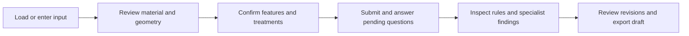
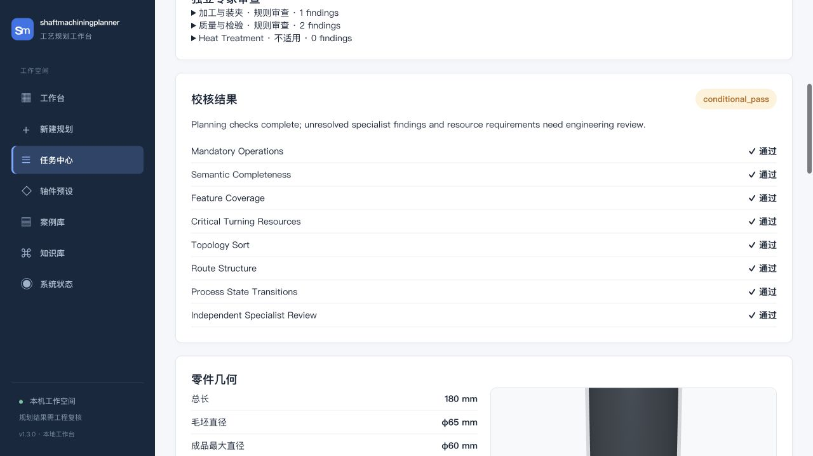
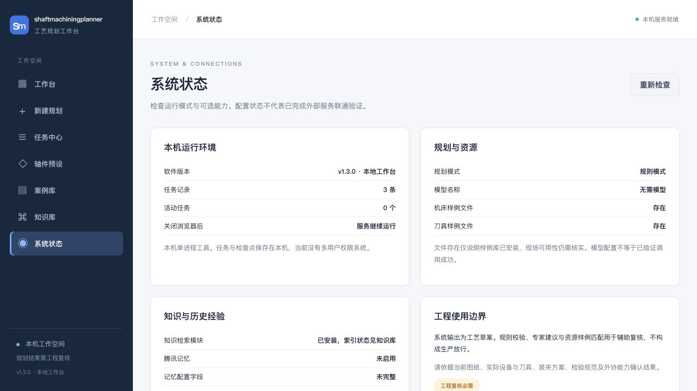

# shaftmachiningplanner user guide

Version 1.3.0. The local workbench supports shaft process planning, resource screening, and engineering review. Screenshots show the Simplified Chinese interface using synthetic inputs in rules mode.


## Navigation

| Page | Purpose | Typical action |
| --- | --- | --- |
| Workbench | Summary and recent tasks | Review pending items or start from a new form, preset, or case |
| New plan | Structured input and browser draft | Define the part and treatment requirements, then submit |
| Task center | History and continuation | Search by name, material, or ID; filter status; reuse original input |
| Shaft presets / Case library | Input templates | Load and revise a template against the current drawing |
| Knowledge library | Optional RAG documents and index | Inspect module availability, documents, and indexing |
| System status | Configuration and shutdown | Inspect runtime mode, resource files, optional services, and task counts |

## Installation and startup

Use Python 3.10, matching the core lockfiles and CI. From the repository root:

```bash
python -m venv .venv
# macOS / Linux
source .venv/bin/activate
# Windows PowerShell: .venv\Scripts\Activate.ps1
python -m pip install --require-hashes -r requirements.lock.txt
cp .env.example .env
python start_shaftplanner.py
```

In PowerShell, copy the configuration with `Copy-Item .env.example .env`. The example selects `LLM_PROVIDER=rules` and disables external memory, so the core workflow runs without a model key.

Open <http://127.0.0.1:8000>. The launcher checks service identity and readiness and reports port conflicts or startup timeouts. If you change a port, update its corresponding `BACKEND_PORT` / `BACKEND_URL` or `FRONTEND_PORT` / `FRONTEND_URL` together.

Services continue running after the browser closes. Use Ctrl+C in the launch terminal or the stop action in System status. Optional idle shutdown uses `AUTO_SHUTDOWN_ON_IDLE=true` and a default 300-second heartbeat timeout; running jobs and jobs awaiting human input are protected.

For separate development startup, set a nonempty `LOCAL_API_TOKEN` in the local `.env` and use the same value in both services. Run these commands in separate terminals:

```bash
python backend/run_backend.py
python frontend/run_frontend.py --frontend-only --no-browser
```

The unified launcher handles credentials for normal local use. Keep actual tokens out of screenshots and version control.

## Planning workflow



1. Open New plan and define material, blank geometry, shaft segments, features, and treatment requirements against the drawing.
2. Set a searchable part name. Weight, surface treatment, and batch size are saved with the request. Route preview and submission use the same form parameters.
3. Save a browser draft when pausing input. A manual save replaces the previous draft in that browser; restore it after refreshing. The draft is stored separately from server task records.
4. Submit and inspect the task status. Supply the requested process choice or engineering answer when prompted. Expand agent tasks and traces to inspect execution evidence.
5. Review the route, resource candidates, deterministic checks, and specialist findings. Edit and revalidate the route as needed, then export an Excel process draft to `output/`.

Task details expose cancellation and cumulative execution records. Human continuation and edited-route review share the run budget; see [Architecture and harness](langgraph-harness.md).

### Example: stepped shaft


The example uses 45 steel, a solid blank of diameter 65 mm, and three segments: S01 diameter 60 × length 80 mm, S02 diameter 50 × length 60 mm, and S03 diameter 45 × length 40 mm. Total length is 180 mm. Features include a keyway and a hole.

Review tolerances, roughness, and treatment requirements for the intended part. The blank diameter must accommodate the maximum finished diameter. Feature locations use either global coordinates or offsets within a segment. Existing blank bores and required finished bores have separate fields. Heat-treatment requirements come from the current drawing.

### Task history and continuation


The task center supports search, status filters, and pagination. Reusing input loads a previous request into the form; submission creates an independent task and preserves the source record.

| Status | Meaning | Next action |
| --- | --- | --- |
| Queued / Running | Accepted and waiting or executing | Inspect progress; cancel if necessary |
| Pending process choice | A precision feature needs an operation-timing decision | Select an option provided by the page |
| Pending engineering input | A task requires blocking information | Supply the requested evidence or answer |
| Draft generated | Planning completed with a reviewable result | Inspect verdicts, conditions, resources, and route |
| Resource mismatch | Core resource screening failed | Check sample coverage and obtain actual capability data |
| Execution failed | Verification or runtime control failed | Inspect failure records; correct input/configuration and create a new task |
| Interrupted by restart | Startup detected unfinished execution | Preserve the record and create a new task from saved input |
| Cancelling / Cancelled | Cooperative stop requested or completed | Wait for in-flight work to finish; create a new task to replan |

Browser draft restoration restores an unsubmitted form. Human continuation resumes the same task checkpoint. Historical-input reuse creates a new task. Each operation has its own persistence and execution semantics.

### Results and route revisions



`pass` and `conditional_pass` are software verification verdicts. For `conditional_pass`, inspect the outstanding conditions, specialist findings, and resource gaps. Engineering release requires site-specific confirmation of workholding, parameters, stock, and inspection.


Operations display public resource candidates and coverage notes. Missing coverage remains an explicit review item. Route edits are copied to a candidate, structurally validated, rematched to resources, and reviewed by specialists and deterministic rules. A successful review increments the route revision; failure retains the current published route and records the review error.

Excel exports contain process drafts. Preserve revision identifiers and engineering review records alongside exported files so that the current route can be identified.

### Runtime records and cancellation


`run_id` identifies the run. `invocation_id` identifies an initial execution, human continuation, or edited-route review. Budgets accumulate across these invocations. Active time is recorded when an invocation ends and excludes human waiting. Missing model-usage observations remain unknown.

The workbench asks for confirmation before requesting cancellation. Cancellation stops subsequent execution at control boundaries; in-flight model calls and local functions must return or time out. The task may show Cancelling during this interval. Original input and execution evidence are retained, and cancelled jobs stop presenting pending answer forms.

## Restart, retention, and backup

SQLite stores tasks, inputs, results, traces, and LangGraph checkpoints. The default path is `data/jobs.sqlite3`; override it with `JOB_DB_FILE`.

- On startup, queued and running jobs become interrupted, and cancellation recovery resolves cancelled jobs. Jobs waiting for human input retain their questions and checkpoints.
- At job creation, cleanup is considered when the total record count reaches 600. If terminal records exceed 500, terminal history is pruned to at most 500 records. Human-waiting records are excluded from that cleanup set.
- Stop both services before backing up. Copy the database and any remaining `-wal` / `-shm` companion files, together with required files in `output/`.
- Stop services before restoring. Retain a copy of the current database, restore to the configured path, and verify version compatibility before startup.
- Case-library data and knowledge indexes have separate files. Include the relevant data directories when migrating a workspace. Browser drafts remain in browser storage.

## Configuration and upgrades

System status reports mode, public resource files, optional knowledge modules, memory configuration, and task counts. It displays local configuration without sending part data to external services. Live connectivity is checked separately.



The [memory integration assessment](../research/tencentdb-agent-memory-integration.md) describes service deployment and read-only retrieval. Local tasks and checkpoints continue to use SQLite.

Before upgrading, stop services and back up data. Update code, install the version's locked dependencies, restart, and verify System status and one synthetic planning run. Development checks use `requirements-dev.lock.txt` and `python -m pytest -q`.

## Troubleshooting

| Symptom | Diagnosis and action |
| --- | --- |
| Port already in use | Inspect the service identity in startup logs. Change the corresponding port and URL together if required |
| Model configured, but output resembles rules mode | Check System status and startup logs; inspect model-call records for successful provider requests |
| Knowledge library unavailable or empty | Install optional RAG dependencies, configure embeddings, import permitted documents, and inspect the index |
| Memory unavailable or configuration incomplete | Verify memory-core URL, gateway credentials, and identity bindings; complete independent service acceptance |
| Continuation rejected after configuration/resource changes | Restore a compatible environment or create a new task from the saved input |
| Budget exhausted | Inspect the stop reason and usage. Diagnose input or repeated execution; HARNESS changes apply to new runs |
| Legacy result has no harness record | Check the legacy/demo-cache notice; the record predates the current execution controls |
| Task missing | Check `JOB_DB_FILE`, retention, and available backups |

See the [harness reference](langgraph-harness.md) for policies and fault classes, and the [evaluation protocol](../evaluation/README.md) for prompt candidates.

## Deployment scope

Version 1.3.0 supports local demonstrations and engineering-assistance validation. Multi-user authorization, centralized audit, packaged installation, and factory acceptance remain future work. Resource samples establish preliminary capability coverage; actual machines, tools, subcontracting, and production release require engineering confirmation.
