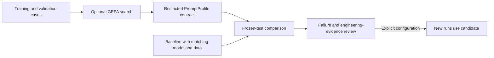

# Agent evaluation and prompt candidates

The evaluation suite exercises shaftmachiningplanner's workflow contracts and records case-level failures. Run from the repository root with development dependencies installed.

## Deterministic evaluation

```sh
python scripts/evaluate_agents.py --output output/evaluation/baseline-rules.json
python scripts/evaluate_agents.py --profile evaluation/profile.example.json --baseline output/evaluation/baseline-rules.json --output output/evaluation/candidate-rules.json
```

The default runner forces rules mode, disables external memory and LangSmith tracing, and isolates its task store. Eleven synthetic cases cover solid/hollow blanks, precision features, keyways, heat treatment, invalid inputs, and unknown-material rejection.

Case families must remain within one train/validation/test split. Scores use backend status, required roles, rule checks, and recorded failures. Successful repair preserves evidence of errors in the original proposal. Reports contain case-level failure records, version/data digests, elapsed time, and observed token usage. Missing usage and pricing remain unknown.

Rules-mode comparisons exercise workflow behavior. prompt-quality comparisons require model-backed runs. `ready_for_engineering_review` indicates that behavioral gates were met; evidence quality and engineering applicability still require review.

## Model-backed comparison

Set `LLM_PROVIDER` and its credentials, then opt in with `--live`. This uses the configured local or remote model service. Generate baseline and candidate reports with the same model, data, and split:

```sh
python scripts/evaluate_agents.py --live --split test --output output/evaluation/baseline-live.json
python scripts/evaluate_agents.py --live --split test --profile output/evaluation/optimization/candidate.json --baseline output/evaluation/baseline-live.json --output output/evaluation/candidate-live.json
```

## Optional GEPA optimization

Version 1.4.0 reports include deterministic `trace_grading` for node attempts and specialist evidence contracts, plus `feedback.constraint_counterexamples`. Failed attempts, model-call errors, degraded review, stale route references, and unacquired citations remain visible after recovery. Procedure-catalog identity participates in run comparison; compare candidates against the same instruction and runtime baseline.

Cases may declare `expected.required_constraint_codes` to require specific final verification issues. Engineer-reviewed cases should distinguish initial proposal failures, successful repair, and final engineering disposition. Procedure/context tests use substitute model clients; they establish boundary behavior rather than real-model quality gains.

The optimization lockfile pins GEPA core to 0.1.4. Use a separate environment to preserve application dependencies:

```sh
python -m venv .venv-optimization
.venv-optimization/bin/python -m pip install --require-hashes -r requirements-optimization.lock.txt
.venv-optimization/bin/python scripts/optimize_agent_prompts.py --live --reflection-model YOUR_CONFIGURED_MODEL --max-evaluations 10
```

The reflection model uses the existing OpenAI-compatible client, endpoint, and credentials. The optimizer receives training and validation cases; the frozen test set is reserved for final comparison. Each evaluation executes the workflow and writes a trial report.

`--max-evaluations` limits GEPA metric calls. A metric call can execute several agents, and reflection adds model requests. Budget model calls, token usage, and provider costs across the full search separately from this metric limit.

## Candidate promotion

Candidates must satisfy the restricted `PromptProfile` JSON contract. They can supplement guidance for existing roles; rules, tools, permissions, and datasets remain fixed by the application.



After frozen-test comparison and engineering review, set `AGENT_PROMPT_PROFILE` explicitly to activate the saved candidate. Clear the setting to roll back. Initial execution snapshots prompt contents; human continuation and edited-route review reuse that snapshot and accumulate the same run budget. Incompatible configuration or resource versions reject continuation. Apply new profiles through new tasks or new evaluation runs.

## Budget accounting and evidence coverage

Online and offline execution share the [harness](../docs/langgraph-harness.md). Budget stops are recorded as inspectable failures. Per-run node/request limits cover the workflow invocation sequence; search-wide accounting must include all trials and reflection requests.

The current suite establishes expected behavior on synthetic cases. Real-model optimization gains and factory outcomes remain unmeasured. The next dataset should include engineer-approved representative shafts, forbidden-route counterexamples, expected checks, missing-information requirements, and verified resource samples. Variants of the same part belong to a common family for splitting and evidence accounting.
