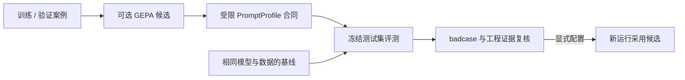

# shaftmachiningplanner Agent 评测与提示词候选

在仓库根目录、已安装开发依赖的 Python 环境运行：

```sh
python scripts/evaluate_agents.py --output output/evaluation/baseline-rules.json
python scripts/evaluate_agents.py --profile evaluation/profile.example.json --baseline output/evaluation/baseline-rules.json --output output/evaluation/candidate-rules.json
```

默认强制规则模式，关闭远程记忆与 LangSmith tracing，不调用模型、不改变真实任务数据库。
11 个案例是合成数据，覆盖实心/空心、精度、键槽、热处理、错误输入和未知材料拒绝。
同一零件家族不可跨 train/validation/test。通过代表流程行为符合预期，不代表加工精度、现场可行性或生产认证。

评分读取后台状态、必需角色、规则检查和实际失败记录。修复后成功不会掩盖原提案错误。
输出包括逐案例 badcase、版本和数据摘要、耗时、真实返回 token；缺失用量与价格保持未知。
规则模式对比不会把提示词候选标记为已验证。`ready_for_engineering_review` 也只代表行为门槛满足，仍需检查证据质量和工程适用性。

真实模型评测需先设置现有 `LLM_PROVIDER` 和对应凭据，再显式加 `--live`。
此选项会调用配置的模型，本地模型或远程提供方按当前配置使用。先生成相同模型/数据/划分的 baseline，再对比候选：

```sh
python scripts/evaluate_agents.py --live --split test --output output/evaluation/baseline-live.json
python scripts/evaluate_agents.py --live --split test --profile output/evaluation/optimization/candidate.json --baseline output/evaluation/baseline-live.json --output output/evaluation/candidate-live.json
```

可选 GEPA 核心依赖固定为 0.1.4；安装到独立的优化环境，以免影响应用依赖：

```sh
python -m venv .venv-optimization
.venv-optimization/bin/python -m pip install --require-hashes -r requirements-optimization.lock.txt
.venv-optimization/bin/python scripts/optimize_agent_prompts.py --live --reflection-model YOUR_CONFIGURED_MODEL --max-evaluations 10
```

反思模型通过现有 OpenAI 兼容客户端调用，使用当前 endpoint 和凭据，不另装 LiteLLM。
优化器只能接触训练与验证案例，冻结测试集不传给优化器。每次评测运行实际工作流并写入 trial 报告。
`--max-evaluations` 是 GEPA metric 调用预算，**不是**总模型调用数或费用上限：每次工作流还可能调用多个 Agent，反思也会调用模型。
返回候选必须符合受限 PromptProfile JSON，只能补充现有角色指导，不能改规则、工具、权限或数据集。
候选文件保存后仍未启用；通过冻结测试集及工程复核后，可显式设置 `AGENT_PROMPT_PROFILE`，清空该设置即可回滚。
服务首次执行保存提示词内容快照，人工恢复与路线编辑复核沿用原快照，并累计同一运行的预算。配置身份或资源版本不兼容时拒绝沿旧检查点继续。候选启用后应创建新任务或新的离线评测运行。



在线与离线共用运行 Harness。预算停止会保存为可检查的 badcase；单次图运行的节点 / 请求额度不等于整个优化搜索的总费用上限。预算和故障行为详见 [Harness 架构](../docs/langgraph-harness.md)。

真实提升的下一步证据是：工程师确认的代表性轴件、禁止路线反例、预期检查/缺失资料，以及正确设备和刀具样本。
无需把同一轴件的多个变体算成独立工厂案例。目前没有真实模型优化增益或现场收益结论。
