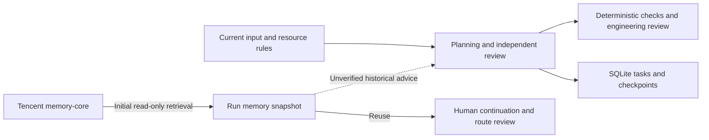

# TencentDB Agent Memory integration assessment

Reviewed on 2026-10-07. TencentDB-Agent-Memory is suitable for an optional historical-context layer in shaftmachiningplanner. Task persistence and workflow recovery continue to use the local JobStore and SQLite checkpoints.

The assessment uses [TencentCloud/TencentDB-Agent-Memory](https://github.com/TencentCloud/TencentDB-Agent-Memory), default branch `feat/server_team`, at commit `8b86874a2daea49e3ff0fb53d699203146c5c77d`. The source [LICENSE](https://github.com/TencentCloud/TencentDB-Agent-Memory/blob/8b86874a2daea49e3ff0fb53d699203146c5c77d/LICENSE) is MIT; GitHub metadata reports NOASSERTION. The reviewed README identifies Team Memory Beta. Pin the integration contract and revalidate it on upgrades.

## Responsibilities

Implementation update, 2026-10-08: version 1.4.0 adds a local, reviewed experience library. Applicable, approved, unexpired cards can join the initial reference snapshot while Tencent remains disabled or unavailable. Source-route binding, review decisions, and validity are managed locally; the adapter continues to make read-only Tencent requests. See [Engineering agent extensions](../docs/engineering-agents.md). The upstream review pinned above remains a 2026-10-07 source snapshot.



| Data or operation | Current ownership | Rationale |
| --- | --- | --- |
| Historical process gaps, recurring errors, collaboration experience | Retrieved as unverified references with record IDs and versions | Helps direct review of the current part |
| Drawing, material, dimensions, tolerances | Structured request | Defines the current planning requirements |
| Machine, tool, and supplier capability | Authoritative resource data | Establishes current capability and availability |
| Agent tasks, human interrupts, checkpoints | JobStore and LangGraph | Preserves execution state and recovery |
| Approval, production release, equipment operation | External engineering and authorization processes | Requires explicit authority and site acceptance |

The upstream service includes Chat Memory, Skill, LLM-Wiki, Code-Graph, and team/user/agent governance. The current adapter retrieves L1 episodic records only. Skill execution, automatic conversation-capture Proxy integration, and write-back of model conclusions are outside this adapter's scope.

## Adapter contract

`backend/agent_memory.py` implements a wire adapter using existing dependencies. The contract was checked against the pinned [v3 SDK](https://github.com/TencentCloud/TencentDB-Agent-Memory/blob/8b86874a2daea49e3ff0fb53d699203146c5c77d/sdk/memory-core/python/tencentdb_agent_memory/v3/client.py), [HTTP transport](https://github.com/TencentCloud/TencentDB-Agent-Memory/blob/8b86874a2daea49e3ff0fb53d699203146c5c77d/sdk/memory-core/python/tencentdb_agent_memory/_v3_http.py), [server router](https://github.com/TencentCloud/TencentDB-Agent-Memory/blob/8b86874a2daea49e3ff0fb53d699203146c5c77d/MemoryCore/src/gateway/v2-router.ts), and [API documentation](https://github.com/TencentCloud/TencentDB-Agent-Memory/blob/8b86874a2daea49e3ff0fb53d699203146c5c77d/MemoryCore/v3-api-memorycore-doc.md).

```text
POST <memory-core origin>/v3/atomic/search
Authorization: Bearer <gateway key>
x-tdai-service-id: <instance id>

{"team_id":"...","agent_id":"...","user_id":"...","query":"...","type":"episodic","limit":5}

{"code":0,"data":{"items":[{"id":"...","version":2,"type":"episodic","content":"...","team_id":"...","agent_id":"...","user_id":"..."}]}}
```

Atomic search uses integer versions; update APIs may use strings such as `v2`. The adapter accepts positive integer search versions and rejects records with missing versions, missing or mismatched identities, or instruction types.

Queries send material, blank type, heat-treatment requirements, and feature types. Full drawings, dimensions, process routes, and conversations are excluded from the query. Retrieval runs once on initial execution; later human continuation and route review reuse the persisted snapshot.

| Limit | Value |
| --- | --- |
| Retrieved records | 5 |
| Content per record | 1600 characters |
| Combined record JSON | 6000 characters |
| Response size | 64 KiB |
| Network timeout | 2 seconds per network operation |
| Redirects / retries | Disabled |
| Remote transport | HTTPS; loopback HTTP permitted |

Retrieved records identify the memory-service source; their original engineering documents and review status remain unverified. All content is treated as untrusted historical advice. Current structured input and server rules constrain its use. Textual instructions alone provide incomplete prompt-injection protection.

The result API exposes `memory_context` with retrieval, empty, or unavailable status and a summary. Telemetry stores summaries and excludes credentials. Retrieval failure allows the existing rules/review workflow to continue. Enabling memory bypasses whole-task caching; snapshot changes invalidate prior task results.

## Configuration and deployment

Deploy and validate the upstream service independently, then configure the local `.env`:

```dotenv
AGENT_MEMORY_ENABLED=true
AGENT_MEMORY_URL=http://127.0.0.1:8420
AGENT_MEMORY_API_KEY=
AGENT_MEMORY_SERVICE_ID=
AGENT_MEMORY_TEAM_ID=
AGENT_MEMORY_AGENT_ID=
AGENT_MEMORY_USER_ID=
```

Fill the empty fields with actual deployment values and restart. Incomplete configuration returns unavailable. The URL must point to memory-core; Panel uses port 8125 and Proxy uses port 8096. HTTP is restricted to loopback addresses; remote endpoints require HTTPS.

Configure the upstream instance, gateway key, and actual team/user/agent bindings. Use explicit bindings for factory experience. The application currently uses one fixed principal. Multi-user authorization requires a separate identity and access-control design.

The pinned [deployment template](https://github.com/TencentCloud/TencentDB-Agent-Memory/blob/8b86874a2daea49e3ff0fb53d699203146c5c77d/deploy/global-images/.env.example) records these considerations:

- Open-source memory-core defaults to SQLite and runs without an external database purchase.
- Optional MongoDB mode is experimental and requires mongot support.
- Extraction/summarization models and Proxy upstream models have separate configuration. Review their endpoints and data destinations.
- An empty `MEMORY_CORE_GATEWAY_API_KEY` disables the Bearer gate. Enable gateway authentication for this adapter. The template documents a Proxy authentication compatibility limitation with nonempty keys.
- Retrieval includes recall-metric and OpenTelemetry reporting points. Review the configured telemetry backend before deployment.

Pin reviewed image tags or digests for service upgrades.

## Acceptance sequence

| Stage | Required checks | Outcome |
| --- | --- | --- |
| Independent deployment | Pinned version, gateway authentication, instance identity, principal bindings | Test API with synthetic records |
| Contract validation | Identity fields, integer versions, episodic type, response limits | Configure the read-only adapter |
| Isolated integration | Retrieval, empty results, failure fallback, snapshot reuse | Build representative evaluation cases |
| Engineering review | Source provenance, applicability, false recall, evidence gaps | Select experience suitable for the workspace |

Simulated HTTP tests cover contracts, identity checks, fallback, content limits, version invalidation, and LangGraph integration. Live-service connectivity, retrieval quality, latency, and factory acceptance remain pending. The assessment used no Tencent service deployment, cloud instance, real factory data, or paid model calls. System status reports configuration completeness separately from acceptance.

## Future database decisions

Shared machine or work-order master data may justify a separate TencentDB PostgreSQL/MySQL assessment. Larger vector retrieval workloads may justify VectorDB. Either decision requires explicit transaction boundaries, queue/lease coordination, file storage, and distributed checkpoint design alongside storage migration.
